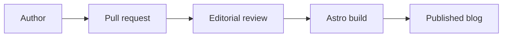

Exporting a blog from Medium sounds like a tidy administrative task until you actually do it.

In theory, you click export, receive a bundle of posts and images, and move on with your life. In practice, you get Markdown files that still remember they once lived inside a commercial publishing platform. Some images are grouped in ways that make sense to the exporter, not to future maintainers. Some formatting needs repair. Some code is no longer code. Some posts carry small platform artifacts, like bits of sign-in text or engagement counters, which are not exactly the kind of institutional memory we were hoping to preserve.

This is not a complaint about Medium. Medium made it easy for the Netherlands eScience Center to publish hundreds of posts about research software engineering, data science, digital scholarship, open science, and the strange joy of debugging things that were definitely working yesterday. It gave us a simple writing interface and a familiar reading experience.

But the migration made one thing very clear: if a blog is part of an institute's knowledge infrastructure, then the content should be owned, reviewable, portable, and reusable in the same way we expect research software to be.

That is why we moved the eScience Center blog to [Astro](https://astro.build/), backed by Markdown, Git, and repository-managed assets.

## A blog archive is research infrastructure

The eScience Center blog is not only a place where we announce things. It is an archive of how research software practice changes over time: FAIR software, reproducibility, machine learning, high-performance computing, digital humanities, software sustainability, community building, and many more topics that are easier to understand through stories than through policy documents.

That makes durability important. Medium is a rented publishing platform. It can change URL structures, recommendation behavior, export quality, sign-in prompts, embed support, typography, analytics, and publication policies. Most of the time that is fine, until it is not.

With Astro, posts live as plain Markdown in Git. Images live in the repository. URLs, redirects, metadata, source links, and archive structure are under our control. The archive can be backed up, reviewed, indexed, reused, and moved again if we ever need to. The blog becomes less like a set of pages inside someone else's product and more like a maintained research software project.

That sounds less glamorous than "new website", but it is the part that matters.

## The migration was also a cleanup project

Moving the blog was not just a visual redesign. It forced us to look at the actual shape of the archive.

We added redirects so old Medium URLs can keep leading readers to the right articles. We restored imported links and images where the export had missed them. We fixed list formatting, image captions, favicon assets, RSS behavior, post slugs, and content locations. We added checks for frontmatter and image references. We also found remaining work, including migrated posts where code still needs to be rendered as code and a few entries where Medium artifacts or missing content need more cleanup.

This is the honest part of any migration. The first working version is not the final clean archive. But because the content is now in Git, the cleanup work is visible, reviewable, and incremental. Each improvement can be tracked as an issue or pull request instead of being a private edit inside a web editor.

For research software people, this is a familiar pattern. You inherit something useful, discover the edge cases, write down the mess, then gradually turn it into infrastructure that can survive other people's future plans. Glamorous? Not really. Useful? Very.

## Publishing as reviewable work

The new workflow also changes how new posts can be published.

Instead of editing directly inside a platform, an author can create a Markdown file, open a pull request, and assign the editorial board for review. Editors can comment on exact lines, suggest wording changes, ask for missing context, check links, discuss figures, and approve the post before it is merged. The discussion remains attached to the article history.

This is common in software documentation, open-source projects, and an increasing number of Git-based publishing workflows. It is not a perfect replacement for a casual web editor. For quick drafting, Medium still wins on convenience. But once an article becomes institutional knowledge, reviewability matters more than convenience.

The pull request model gives us a publication trail: what changed, who reviewed it, what was discussed, and when it was accepted. That is not bureaucracy for its own sake. It is the same principle that makes code review useful. Good editorial work is collaborative, and the collaboration should not disappear the moment someone presses publish.

## What we could not do before

Medium was designed for essays. Our blog often needs to publish technical explanations.

That difference shows up quickly. If you wanted to show code nicely on Medium, the usual workaround was to put the code in a GitHub Gist and embed it. That works, but it splits the article from the example. It also makes the simple thing strangely ceremonial: write code, put it somewhere else, embed the somewhere else, hope the embed behaves.

In Astro, code blocks are just Markdown:

```python
def estimate_reading_time(words: int, words_per_minute: int = 225) -> int:
    return max(1, round(words / words_per_minute))
```

The same applies to other forms of technical communication. We can now include Mermaid diagrams directly in posts:



We can write LaTeX when a post needs mathematical notation, such as $E = mc^2$ or a full display equation:

$$
\operatorname{softmax}(x_i) = \frac{e^{x_i}}{\sum_j e^{x_j}}
$$

We can use small custom HTML elements, such as expandable notes, when they help the reader. We can embed videos or interactive figures when the provider allows it. We can build unlisted showcase pages to test rich content before using it in public posts.

These are not decorative features. They matter because research software communication often needs more than paragraphs and images. Sometimes the clearest explanation is a diagram. Sometimes it is a formula. Sometimes it is a short code block. Sometimes it is an interactive example. The publishing system should not make the useful form of explanation feel like a hack.

## More than pages: a reusable archive

Astro also lets us treat the blog as structured data.

The site now has author pages, topic pages, archive search, RSS, and JSON endpoints for posts, authors, and topics. Tags can become topic collections. Authors can become real archive entries instead of generic platform profiles. Posts can link more naturally to GitHub repositories, Zenodo records, Research Software Directory entries, papers, datasets, projects, and contributors.

This is where the migration connects directly to open science and FAIR practice. A blog post about research software should be able to point to the software, its citation, its documentation, its maintainers, and related work. Over time, the archive can become a map of the knowledge around our software, not only a chronological list of articles.

Because the site is static, it is also fast by default. Astro sends mostly HTML and only the JavaScript we need. That gives us direct control over page weight, accessibility, metadata, dark mode, responsive images, browser behavior, and analytics. We can use our own analytics setup, rather than accepting whatever the publishing platform provides. We can design the reading experience around the eScience Center, not around a feed optimized for someone else's engagement model.

The sky is not the limit. The sky is where the backlog starts. The practical work is choosing which ideas are worth maintaining.

## What Medium still does better

There are trade-offs.

Medium is easier for casual authors. You paste text and images into an editor, move things around visually, and publish without thinking about Git, Markdown, local previews, or pull requests. It also has built-in discovery, recommendations, followers, claps, and comments. We do not get all of that for free in an Astro site.

Some of those features may be worth rebuilding or replacing later. Some may not. Comments, for example, are useful when they create conversation and less useful when they create moderation work. Claps are a nice signal, but they are not the only measure of whether an article helped someone. Built-in discovery is convenient, but it comes with platform distractions and less control over how readers encounter the work.

The contributor experience also needs care. If we want researchers and research software engineers to write comfortably, we need clear authoring documentation, good preview workflows, sensible image handling, and help for people who do not want to think about repository structure before their first coffee.

This is still work. The difference is that we can now do the work in the open.

## The lesson we are taking forward

The migration from Medium to Astro started as a publishing task and turned into a small lesson in research software sustainability.

Owning the source matters. Review workflows matter. Plain text matters. URLs matter. Metadata matters. So do captions, redirects, feeds, code blocks, and all the other unglamorous details that make knowledge easier to preserve and reuse.

For readers, we hope the result still feels simple: open an article, read it, find related work, follow useful links, maybe copy a code snippet that actually renders as code. For authors and editors, the important change is behind the scenes. A post is now part of a versioned, reviewable, open-source workflow.

That feels appropriate for an institute that works on research software.

The old blog helped us publish. The new one should help us maintain a living archive. If we do this well, future posts will not only be easier to read. They will be easier to review, reuse, preserve, and connect to the software and research they describe.

That is a better place to write from.
