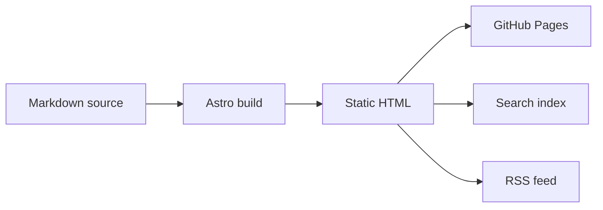

When we rebuilt the eScience Center blog with Astro, we brought the publishing chain into the repository. The source, validation rules, routes, generated feeds, and browser features now sit together where we can inspect and change them.

A post begins as Markdown in a public [Git repository](https://github.com/nlesc-blogging/blog). During the build, we validate it, combine it with structured metadata, and generate the different forms in which readers and other systems use it. [Astro](https://astro.build/) sends static HTML to the browser unless a particular feature needs JavaScript.

We can try more technical article formats without making every page depend on JavaScript.

The wind map below is one simple example. It remains interactive inside the article instead of becoming a screenshot.

<figure>
  <iframe
    src="https://earth.nullschool.net/#current/wind/surface/level/orthographic=-2.01,36.79,542"
    title="earth.nullschool.net global wind visualization"
    loading="lazy"
    style="width: 100%; min-height: 560px; border: 1px solid #e5e5e5; border-radius: 12px;"
    allowfullscreen>
  </iframe>
  <figcaption>Source: <a href="https://earth.nullschool.net/">earth.nullschool.net</a> by <a href="https://www.linkedin.com/in/cambecc/">Cameron Beccario</a> and Nullschool Technologies. Weather data comes from GFS by EMC, NCEP, NWS, and NOAA, with additional ocean, chemistry, aurora, UV, and fire data sources listed on the <a href="https://earth.nullschool.net/about.html">project about page</a>.</figcaption>
</figure>

## A static site with a programmable build

Astro sits between the article source and the public website. During a build, it reads our content collection, validates frontmatter, renders Markdown with `remark-math` and `rehype-katex`, and generates static HTML.

The build step is ordinary project code, so we can inspect and extend it. It checks content, transforms data, creates indexes, and produces multiple views from the same article. The browser still receives an ordinary static page unless a feature needs JavaScript.

The current site already uses this build in several places.

- `@astrojs/sitemap` generates sitemap files from the available routes.
- `@astrojs/rss` builds `/rss.xml` from the post collection.
- `src/pages/search-index.json.ts` exports data for the browser search interface.
- `src/pages/api/*.json.ts` exposes post, author, and topic data.
- `BaseLayout.astro` loads browser scripts for Mermaid, search, dark mode, and image behavior.
- Astro components keep author cards, topic lists, layouts, and post templates in code.

One Markdown article can therefore appear on a post page, an author page, a topic page, the RSS feed, the search index, and a JSON endpoint. We do not have to maintain a separate copy for each destination.

## Content becomes structured data

Each post lives in its own folder in `content/posts`. The date-prefixed folder contains an `index.md` file and, where practical, the images used by the article.

The title, author, publication status, source, and tags live in the article's frontmatter. The rest of the site can use those fields, and Astro's collection schema checks them before the build succeeds.

The route `src/pages/posts/[...slug].astro` maps each post ID to a URL. The homepage, topic pages, author pages, API endpoints, RSS feed, and search index all read from that same collection.

The same metadata can connect a post to software repositories, Research Software Directory entries, releases, DOIs, papers, datasets, projects, or contributor profiles. Those links could later drive related-content sections, citation blocks, software cards, or project archives.

## Technical media can live with the story

Research software is difficult to explain using prose and screenshots alone. A post may need code, a workflow diagram, a formula, a map, a simulation, or a small interactive demonstration.

We keep an unlisted integration test post in the repository to check these inputs before using them in public articles. It covers fenced Mermaid flowcharts and sequence diagrams, LaTeX, raw HTML details, iframe embeds, WebGL demos, global environmental visualizations, environmental maps, tables, and image paths.

A Python example can remain in an ordinary Markdown fence.

```python
def estimate_reading_time(words: int, words_per_minute: int = 225) -> int:
    return max(1, round(words / words_per_minute))
```

Mermaid diagrams use a fenced block as well.



Mathematical notation stays in the article source.

$$
\operatorname{softmax}(x_i) = \frac{e^{x_i}}{\sum_j e^{x_j}}
$$

When an external provider allows framing, we can place an interactive example beside the explanation it supports. In a story about simulation or visualization, readers can work with the system directly.

<figure>
  <iframe
    src="https://paveldogreat.github.io/WebGL-Fluid-Simulation/"
    title="WebGL fluid simulation by Pavel Dobryakov"
    loading="lazy"
    style="width: 100%; min-height: 560px; border: 1px solid #e5e5e5; border-radius: 12px;"
    allowfullscreen>
  </iframe>
  <figcaption>Source: <a href="https://paveldogreat.github.io/WebGL-Fluid-Simulation/">WebGL Fluid Simulation</a> by <a href="https://github.com/PavelDoGreat/WebGL-Fluid-Simulation">Pavel Dobryakov</a>, MIT license. The project references GPU Gems Chapter 38, <a href="https://developer.nvidia.com/gpugems/gpugems/part-vi-beyond-triangles/chapter-38-fast-fluid-dynamics-simulation-gpu">Fast Fluid Dynamics Simulation on the GPU</a>.</figcaption>
</figure>

Environmental science posts can include live maps in the same way.

<figure>
  <iframe
    src="https://embed.windy.com/embed2.html?lat=52&lon=5&detailLat=52&detailLon=5&width=650&height=450&zoom=4&level=surface&overlay=wind&product=ecmwf&menu=&message=true&marker=&calendar=now&pressure=&type=map&location=coordinates&detail=&metricWind=km%2Fh&metricTemp=%C2%B0C&radarRange=-1"
    title="Windy weather map over the Netherlands"
    loading="lazy"
    style="width: 100%; min-height: 520px; border: 1px solid #e5e5e5; border-radius: 12px;">
  </iframe>
  <figcaption>Source: <a href="https://www.windy.com/">Windy.com</a> embedded weather map using the ECMWF forecast layer. Map data © <a href="https://www.openstreetmap.org/copyright">OpenStreetMap contributors</a>.</figcaption>
</figure>

The examples above use existing services. We can also add custom Astro components, generated figures, WebGL, WebAssembly, or browser-based visualizations. The page remains static until one of those features has a reason to run code in the browser.

## Content checks become part of publishing

Once articles are files in a repository, editorial quality can be checked in the same pipeline as the website.

Our build scripts already validate frontmatter and relative image paths. They could also check the following.

- broken links;
- missing alt text;
- oversized images;
- duplicate titles or slugs;
- invalid DOI or repository links;
- required metadata;
- accessibility regressions;
- generated RSS, search, and API outputs.

A pull request shows the exact lines that changed. Editors can review text, links, figures, and metadata together, preview the branch, and let continuous integration validate the result before deployment.

This gives authors and editors technical feedback before publication. A broken image path or missing field is easier to fix in a pull request than after readers encounter it on the public site.

## Content and presentation can evolve separately

Markdown stores the article's structure and content. Astro components and CSS control how that material is presented.

That separation lets us redesign an author page, change the typography, add a new story layout, or rebuild the topic navigation without rewriting the articles themselves. It also allows individual stories to use a custom layout while the rest of the archive keeps the standard template.

A new API, newsletter feed, annual-report index, or research-software collection can read the existing content and metadata during the build. The archive remains useful input instead of being tied to one visual presentation.

## What we can build next

The current implementation gives us structured Markdown, local assets, content collections, programmable routes, reusable components, validation, static output, and selective JavaScript.

Those pieces let us build around the needs of an article. A climate story could combine a live map with a model diagram. A machine learning article could include an interactive explanation and the relevant code. A software story could connect its narrative to a repository, release metadata, DOI, citation, maintainers, and related projects.

We can also generate curated topic collections, richer author pages, faceted archive search, reusable scientific figures, notebook-derived articles, or machine-readable feeds for other eScience systems.

Most posts will remain straightforward articles, which is exactly what they should be. Astro gives us static HTML by default and more technical depth when a story needs it. We now control the build process that turns the archive into pages, feeds, data, and interactive explanations.
