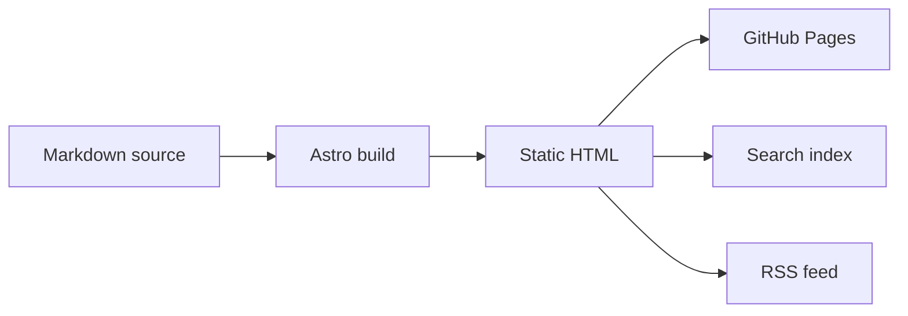

Medium gave us an editor and a place to publish. Our blog had grown to need more than that.

The eScience Center blog contains hundreds of posts about research software, data, high-performance computing, open science, training, and community work. Together, they form part of our institutional memory. Readers need stable links, authors need a review process, and maintainers need files they can inspect, test, and move.

We therefore moved the blog to a public, Markdown-based home. Posts and their assets now live as plain files, Git records every change, and [Astro](https://astro.build/) turns the content into static pages, feeds, search data, and topic pages. The whole setup is available in a [public repository](https://github.com/nlesc-blogging/blog).

This post is also a small demonstration of what the new system can do. The first example is right here: a live environmental visualization embedded in the article, rather than a screenshot or a link that sends you elsewhere.

<figure>
  <iframe
    src="https://earth.nullschool.net/#current/wind/surface/level/orthographic=-2.01,36.79,542"
    title="earth.nullschool.net global wind visualization"
    loading="lazy"
    style="width: 100%; min-height: 560px; border: 1px solid #e5e5e5; border-radius: 12px;"
    allowfullscreen>
  </iframe>
  <figcaption>Source: <a href="https://earth.nullschool.net/">earth.nullschool.net</a> by <a href="https://www.linkedin.com/in/cambecc/">Cameron Beccario</a> and Nullschool Technologies. Weather data comes from GFS by EMC, NCEP, NWS, and NOAA, with additional ocean, chemistry, aurora, UV, and fire data sources listed on the <a href="https://earth.nullschool.net/about.html">project about page</a>.</figcaption>
</figure>

## Why Astro now

GitHub Pages and templates served us well for a long time. They offered static hosting, straightforward layouts, and an inexpensive way to publish.

As the archive grew, so did our requirements. We needed content collections, custom routing, richer Markdown, validation, redirects, search data, RSS, and topic pages, all generated from one source.

Astro provides those layers while keeping the site static and the development workflow approachable. Authors write Markdown. Maintainers work with plain files. Routes, layouts, scripts, and checks remain in code where developers can review and test them.

The architecture also separates content from presentation. We can redesign the site without rewriting the articles, or move the content again without dragging the current design along with it. Future maintainers may thank us for that.

## What changed

Each post now has its own folder in `content/posts`, named with a date prefix. The folder contains an `index.md` file and, where practical, the images used by the article.

Astro reads these folders as a content collection. A schema checks the frontmatter before the site builds. The route `src/pages/posts/[...slug].astro` maps each post ID to a URL, while the homepage, RSS feed, topic pages, author pages, API endpoints, and search index all read from the same collection.

One source feeds every public view. That is a small sentence with a pleasantly large maintenance benefit.

## What Astro adds

Astro sits between the Markdown files and the public site. During a build, it reads the content collections, validates frontmatter, renders Markdown with `remark-math` and `rehype-katex`, and writes static HTML.

A handful of focused components provide the rest:

- `@astrojs/sitemap` writes sitemap files from generated routes.
- `@astrojs/rss` feeds `/rss.xml` from the post collection.
- `src/pages/search-index.json.ts` exports data for the browser search interface.
- `src/pages/api/*.json.ts` exposes post, author, and topic data.
- `BaseLayout.astro` loads browser scripts for Mermaid, search, dark mode, and image behavior.
- Astro components keep author cards, topic lists, layouts, and post templates in code.

The blog remains file-based, but it gains routing, metadata, feeds, JavaScript components, and generated indexes without creating separate sources for each feature.

| Area | Medium limitation | Markdown plus Astro path |
| --- | --- | --- |
| Source files | Content lives behind an editor export. | Posts live as `index.md` beside local assets. |
| Review | Edits happen in the platform UI. | Pull requests show line changes before merge. |
| Technical content | Code, diagrams, formulas, and embeds depend on platform support. | Markdown supports fenced code, Mermaid, LaTeX, raw HTML, and iframe embeds. |
| Routing | URL structure follows platform rules. | `src/pages/posts/[...slug].astro` maps post IDs to URLs. |
| Metadata | Tags and author data stay tied to platform fields. | Frontmatter feeds pages, RSS, search, author pages, and topic pages. |
| Maintenance | Cleanup happens post by post in a web editor. | Scripts check frontmatter, image paths, and generated outputs before publication. |
| JavaScript | The platform decides which scripts run. | Astro loads browser code only where the site needs Mermaid, search, dark mode, or image behavior. |
| Portability | Export quality decides how reusable the content is. | Plain files, assets, and build scripts move together. |

In day-to-day work, this means:

- Pull requests show the exact lines under review.
- Relative image links keep local assets near their source text.
- Date-prefixed folders produce predictable URLs.
- Build scripts catch broken image links and invalid frontmatter.
- Astro ships HTML first and loads JavaScript only for selected features.

The result is closer to a small documentation system than a stack of articles in a web editor. Source files, routes, redirects, metadata, and validation all live in one repository.

## Treating the migration as data

Medium's export gave us Markdown, image files, and metadata. It did not give us a finished archive. The content still needed careful cleanup.

We treated the migration as a data problem and:

- moved posts into date-prefixed folders;
- restored image references;
- normalized slugs;
- added redirects from source URLs;
- checked frontmatter and relative image paths;
- fixed the inputs used by RSS and search.

This work is easy to underestimate. Broken links and missing assets erode an archive one post at a time. Keeping the content in a repository gives us a chance to catch those failures before publication instead of discovering them through a reader's report months later.

## Technical examples

Research software stories often need more than text and images. They may include code, diagrams, formulas, maps, simulations, or a small interactive component. The examples below show how those pieces can live alongside the article source.

We keep an unlisted integration showcase post in the repository to test richer inputs before using them in public posts. It covers fenced Mermaid flowcharts and sequence diagrams, LaTeX, raw HTML details, iframe embeds, WebGL demos, global environmental visualizations, environmental maps, tables, and image paths.

Code blocks remain ordinary Markdown:

```python
def estimate_reading_time(words: int, words_per_minute: int = 225) -> int:
    return max(1, round(words / words_per_minute))
```

The same file can contain Mermaid diagrams:



Math follows the same workflow, so a machine learning post does not need to turn a formula into a screenshot:

$$
\operatorname{softmax}(x_i) = \frac{e^{x_i}}{\sum_j e^{x_j}}
$$

When a provider allows framing, an interactive example can sit inside the article. For a story about simulation or visualization, a WebGL fluid example is much closer to the subject than a static image:

<figure>
  <iframe
    src="https://paveldogreat.github.io/WebGL-Fluid-Simulation/"
    title="WebGL fluid simulation by Pavel Dobryakov"
    loading="lazy"
    style="width: 100%; min-height: 560px; border: 1px solid #e5e5e5; border-radius: 12px;"
    allowfullscreen>
  </iframe>
  <figcaption>Source: <a href="https://paveldogreat.github.io/WebGL-Fluid-Simulation/">WebGL Fluid Simulation</a> by <a href="https://github.com/PavelDoGreat/WebGL-Fluid-Simulation">Pavel Dobryakov</a>, MIT license. The project references GPU Gems Chapter 38, <a href="https://developer.nvidia.com/gpugems/gpugems/part-vi-beyond-triangles/chapter-38-fast-fluid-dynamics-simulation-gpu">Fast Fluid Dynamics Simulation on the GPU</a>.</figcaption>
</figure>

Environmental science posts can use the same pattern for live maps. A weather map gives readers something to explore:

<figure>
  <iframe
    src="https://embed.windy.com/embed2.html?lat=52&lon=5&detailLat=52&detailLon=5&width=650&height=450&zoom=4&level=surface&overlay=wind&product=ecmwf&menu=&message=true&marker=&calendar=now&pressure=&type=map&location=coordinates&detail=&metricWind=km%2Fh&metricTemp=%C2%B0C&radarRange=-1"
    title="Windy weather map over the Netherlands"
    loading="lazy"
    style="width: 100%; min-height: 520px; border: 1px solid #e5e5e5; border-radius: 12px;">
  </iframe>
  <figcaption>Source: <a href="https://www.windy.com/">Windy.com</a> embedded weather map using the ECMWF forecast layer. Map data © <a href="https://www.openstreetmap.org/copyright">OpenStreetMap contributors</a>.</figcaption>
</figure>

Small custom HTML components can support details blocks, embeds, and interactive figures. Unlisted posts give editors a place to test them before publication.

These features are useful because a technical article may need a code sample, workflow diagram, formula, repository link, and citation to explain one piece of work properly. The publishing system should keep those elements close to the text they support.

## Why Git matters

A pull request keeps discussion, review, and approval beside the proposed change. Authors can preview a branch before merge, while continuous integration validates the content before deployment.

Editors review text, links, figures, and metadata in one place. Authors still work in Markdown, and every revision remains visible in the repository history.

This is a familiar research software practice applied to publishing: keep the source accessible, review changes, run checks, and publish from a clean build.

## Room to grow

Markdown and Astro give us a foundation rather than a prescribed final form. We can now add new formats when a story genuinely benefits from them.

That might mean a custom story layout, a reusable interactive figure, a project showcase, a map-based explainer, a richer citation block, or an article-specific component. A climate story could combine a live map with a model diagram. A machine learning story could include a small interactive demo. A research software story could connect its narrative to code, package metadata, and project history.

Most articles will not need any of that. The practical gain is choice: the repository gives us room to build a richer format when the material calls for one.

The blog now works much like the research software projects it describes. Its source lives in Git, builds are repeatable, checks run before publication, routes come from code, and every public view starts with the same content collection. For an institute committed to research software and open science, that feels like the right place for its institutional memory to live.
