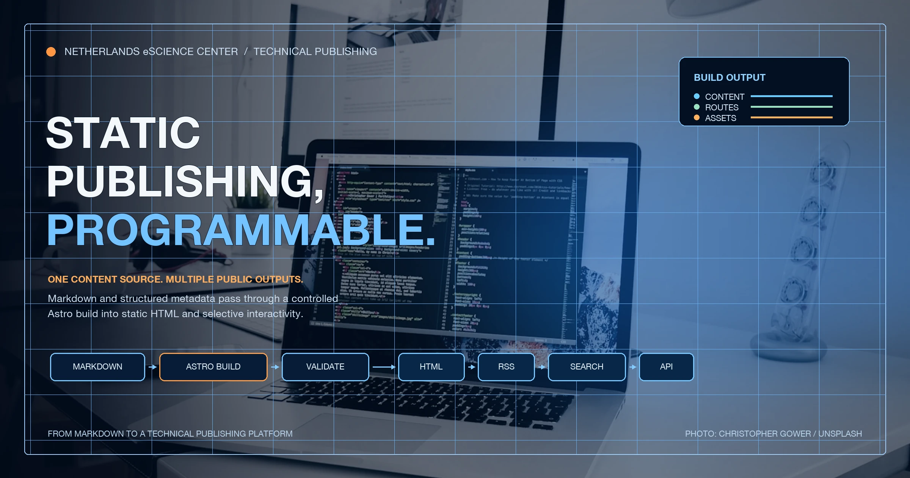
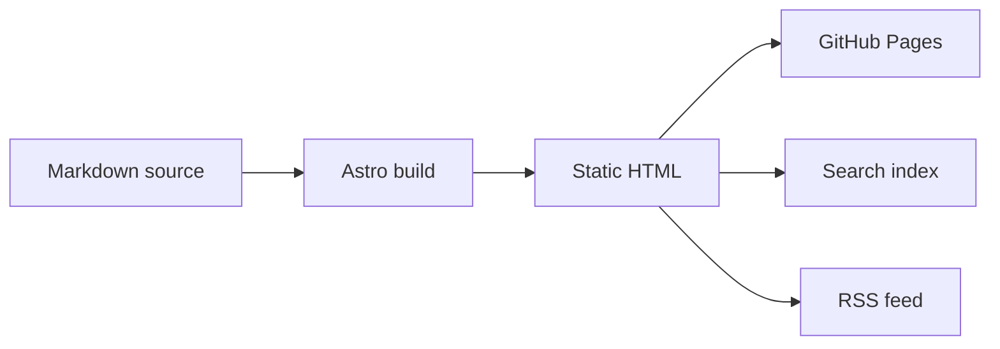

Moving the eScience Center blog to Astro gave us something technically useful: control over the complete path from source file to published page.

Each article starts as Markdown in a public [Git repository](https://github.com/nlesc-blogging/blog). From there, we can validate it, combine it with structured metadata, generate several outputs, and add interactive features where the subject calls for them. [Astro](https://astro.build/) still delivers static HTML to the reader, so the default remains fast and simple.

That combination is the interesting part. Static no longer means fixed. It gives us a controlled base on which we can build richer forms of technical publishing.

Here is an immediate example. This live environmental visualization is embedded directly in the article rather than represented by a screenshot:

<figure>
  <iframe
    src="https://earth.nullschool.net/#current/wind/surface/level/orthographic=-2.01,36.79,542"
    title="earth.nullschool.net global wind visualization"
    loading="lazy"
    style="width: 100%; min-height: 560px; border: 1px solid #e5e5e5; border-radius: 12px;"
    allowfullscreen>
  </iframe>
  <figcaption>Source: <a href="https://earth.nullschool.net/">earth.nullschool.net</a> by <a href="https://www.linkedin.com/in/cambecc/">Cameron Beccario</a> and Nullschool Technologies. Weather data comes from GFS by EMC, NCEP, NWS, and NOAA, with additional ocean, chemistry, aurora, UV, and fire data sources listed on the <a href="https://earth.nullschool.net/about.html">project about page</a>.</figcaption>
</figure>

## A static site with a programmable build

Astro sits between the article source and the public website. During a build, it reads our content collection, validates frontmatter, renders Markdown with `remark-math` and `rehype-katex`, and generates static HTML.

Because that process is code, we decide what happens along the way. A build can check content, transform data, create indexes, and produce multiple views from the same article. The browser receives an ordinary static page unless a feature genuinely needs JavaScript.

The current site already uses this model in several ways:

- `@astrojs/sitemap` generates sitemap files from the available routes.
- `@astrojs/rss` builds `/rss.xml` from the post collection.
- `src/pages/search-index.json.ts` exports data for the browser search interface.
- `src/pages/api/*.json.ts` exposes post, author, and topic data.
- `BaseLayout.astro` loads browser scripts for Mermaid, search, dark mode, and image behavior.
- Astro components keep author cards, topic lists, layouts, and post templates in code.

One Markdown article can therefore appear on a post page, an author page, a topic page, the RSS feed, the search index, and a JSON endpoint. We do not have to maintain a separate copy for each destination.

## Content becomes structured data

Each post lives in its own folder in `content/posts`. The date-prefixed folder contains an `index.md` file and, where practical, the images used by the article.

Frontmatter turns the article into more than a block of prose. Fields such as title, author, publication status, source, and tags become inputs for the rest of the site. Astro's collection schema checks those fields before the build succeeds.

The route `src/pages/posts/[...slug].astro` maps each post ID to a URL. The homepage, topic pages, author pages, API endpoints, RSS feed, and search index all read from that same collection.

This creates room for more structured connections. A post could link to software repositories, Research Software Directory entries, releases, DOIs, papers, datasets, projects, or contributor profiles. Because the metadata is available during the build, those links can also drive related-content sections, citation blocks, software cards, or project archives.

## Technical media can live with the story

Research software is difficult to explain using prose and screenshots alone. A post may need code, a workflow diagram, a formula, a map, a simulation, or a small interactive demonstration.

We keep an unlisted integration showcase post in the repository to test these inputs before using them in public articles. It covers fenced Mermaid flowcharts and sequence diagrams, LaTeX, raw HTML details, iframe embeds, WebGL demos, global environmental visualizations, environmental maps, tables, and image paths.

Code remains ordinary Markdown:

```python
def estimate_reading_time(words: int, words_per_minute: int = 225) -> int:
    return max(1, round(words / words_per_minute))
```

The same source file can contain a Mermaid diagram:



Mathematical notation follows the same workflow:

$$
\operatorname{softmax}(x_i) = \frac{e^{x_i}}{\sum_j e^{x_j}}
$$

When an external provider allows framing, we can place an interactive example beside the explanation it supports. For a story about simulation or visualization, readers can interact with the system directly:

<figure>
  <iframe
    src="https://paveldogreat.github.io/WebGL-Fluid-Simulation/"
    title="WebGL fluid simulation by Pavel Dobryakov"
    loading="lazy"
    style="width: 100%; min-height: 560px; border: 1px solid #e5e5e5; border-radius: 12px;"
    allowfullscreen>
  </iframe>
  <figcaption>Source: <a href="https://paveldogreat.github.io/WebGL-Fluid-Simulation/">WebGL Fluid Simulation</a> by <a href="https://github.com/PavelDoGreat/WebGL-Fluid-Simulation">Pavel Dobryakov</a>, MIT license. The project references GPU Gems Chapter 38, <a href="https://developer.nvidia.com/gpugems/gpugems/part-vi-beyond-triangles/chapter-38-fast-fluid-dynamics-simulation-gpu">Fast Fluid Dynamics Simulation on the GPU</a>.</figcaption>
</figure>

Environmental science posts can use the same approach for live maps:

<figure>
  <iframe
    src="https://embed.windy.com/embed2.html?lat=52&lon=5&detailLat=52&detailLon=5&width=650&height=450&zoom=4&level=surface&overlay=wind&product=ecmwf&menu=&message=true&marker=&calendar=now&pressure=&type=map&location=coordinates&detail=&metricWind=km%2Fh&metricTemp=%C2%B0C&radarRange=-1"
    title="Windy weather map over the Netherlands"
    loading="lazy"
    style="width: 100%; min-height: 520px; border: 1px solid #e5e5e5; border-radius: 12px;">
  </iframe>
  <figcaption>Source: <a href="https://www.windy.com/">Windy.com</a> embedded weather map using the ECMWF forecast layer. Map data © <a href="https://www.openstreetmap.org/copyright">OpenStreetMap contributors</a>.</figcaption>
</figure>

These examples use existing services, but the same architecture can support custom Astro components, generated figures, WebGL, WebAssembly, or browser-based visualizations. The static page remains the foundation. Interactive code is added only where it helps explain the work.

## Content checks become part of publishing

Once articles are files in a repository, editorial quality can be checked in the same pipeline as the website.

Our build scripts already validate frontmatter and relative image paths. The same approach can be extended to check:

- broken links;
- missing alt text;
- oversized images;
- duplicate titles or slugs;
- invalid DOI or repository links;
- required metadata;
- accessibility regressions;
- generated RSS, search, and API outputs.

A pull request shows the exact lines that changed. Editors can review text, links, figures, and metadata together, preview the branch, and let continuous integration validate the result before deployment.

The useful point is technical feedback. An author or editor can see that an image path is broken or a required field is missing before the article reaches the public site.

## Content and presentation can evolve separately

Markdown stores the article's structure and content. Astro components and CSS control how that material is presented.

That separation lets us redesign an author page, change the typography, add a new story layout, or rebuild the topic navigation without rewriting the articles themselves. It also allows individual stories to use a custom layout while the rest of the archive keeps the standard template.

The same principle applies to outputs. A new API, newsletter feed, annual-report index, or research-software collection can read the existing content and metadata during the build. The archive becomes reusable input rather than material locked to one visual presentation.

## What we can build next

The current implementation provides the base pieces: structured Markdown, local assets, content collections, programmable routes, reusable components, validation, static output, and selective JavaScript.

From there, we can build features around actual publishing needs. A climate article could combine a live map with a model diagram. A machine learning article could include an interactive explanation and the relevant code. A software story could connect its narrative to a repository, release metadata, DOI, citation, maintainers, and related projects.

We can also generate curated topic collections, richer author pages, faceted archive search, reusable scientific figures, notebook-derived articles, or machine-readable feeds for other eScience systems.

Most posts will still be straightforward articles, and that is a feature too. Astro gives us static HTML by default and technical depth when we need it. The important change is that we now control the layer in between: the build process that turns institutional knowledge into a website, an archive, and a platform for explaining research software properly.
