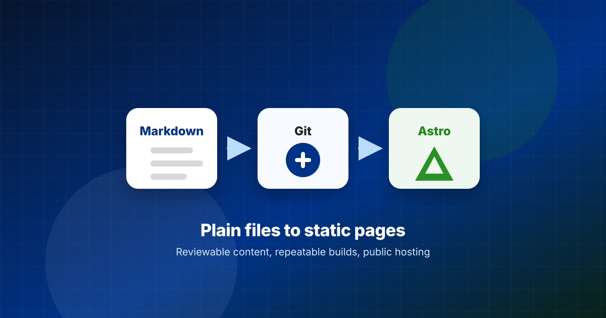
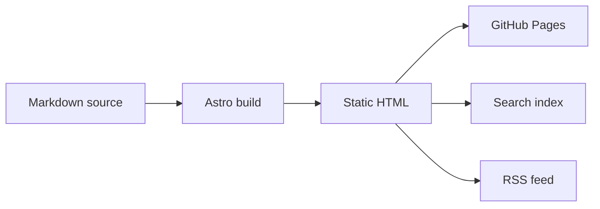

Medium gave us an editor and a place to publish, but the blog needed more than a web form.

The eScience Center blog holds hundreds of posts about research software, data, high-performance computing, open science, training, and community work. Because each post is part of institutional knowledge, readers need stable links, authors need review, and maintainers need files they inspect, test, and move.

For those reasons, we moved the blog to a public Markdown-based host. The source now lives as Markdown with local assets, Git stores every change, and [Astro](https://astro.build/) turns the content into static pages, feeds, search data, and topic pages.

This post is also a small showcase of what the new system makes possible. Here is the change you can see immediately: we can embed a live environmental visualization directly inside an article, instead of adding a static screenshot or sending readers away to another page.

<figure>
  <iframe
    src="https://earth.nullschool.net/#current/wind/surface/level/orthographic=-2.01,36.79,542"
    title="earth.nullschool.net global wind visualization"
    loading="lazy"
    style="width: 100%; min-height: 560px; border: 1px solid #e5e5e5; border-radius: 12px;"
    allowfullscreen>
  </iframe>
  <figcaption>Source: <a href="https://earth.nullschool.net/">earth.nullschool.net</a> by <a href="https://www.linkedin.com/in/cambecc/">Cameron Beccario</a> and Nullschool Technologies. Weather data comes from GFS by EMC, NCEP, NWS, and NOAA, with additional ocean, chemistry, aurora, UV, and fire data sources listed on the <a href="https://earth.nullschool.net/about.html">project about page</a>.</figcaption>
</figure>

## Why Astro now

GitHub Pages and templates served us for a long time because they gave static hosting, simple layouts, and a low-cost publishing path.

As the blog grew, the long-term needs changed. We needed content collections, custom routing, richer Markdown, validation, redirects, search data, RSS, and topic pages from one source.

Astro adds those customization layers on top of static hosting while keeping development accessible. Authors edit Markdown, maintainers work with plain files, and feature work stays in code through routes, layouts, scripts, and checks.

## What changed

Every post now lives in `content/posts` as a folder with a date-prefixed name, an `index.md` file, and images next to the article when practical.

Astro reads these folders as a content collection, while the collection schema checks frontmatter before the site builds. The route `src/pages/posts/[...slug].astro` maps each post ID to a URL, and the homepage, RSS feed, topic pages, author pages, API endpoints, and search index read from the same collection.

One content source feeds every public view.

## What Astro adds

Astro sits between Markdown and public pages. The build reads content collections, validates frontmatter, renders Markdown with `remark-math` and `rehype-katex`, and writes static HTML.

The site gets features from small parts working together:

- `@astrojs/sitemap` writes sitemap files from generated routes.
- `@astrojs/rss` feeds `/rss.xml` from the post collection.
- `src/pages/search-index.json.ts` exports search data for the browser search UI.
- `src/pages/api/*.json.ts` exposes post, author, and topic data.
- `BaseLayout.astro` loads browser scripts for Mermaid, search, dark mode, and image behavior.
- Astro components keep author cards, topic lists, layouts, and post templates in code.

This is the useful layer above plain static hosting. The blog stays file-based, while the site gains routing, metadata, feeds, JavaScript components, and generated indexes from the same source.

| Area | Medium limitation | Markdown plus Astro path |
| --- | --- | --- |
| Source files | Content lives behind an editor export. | Posts live as `index.md` beside local assets. |
| Review | Edits happen in the platform UI. | Pull requests show line changes before merge. |
| Technical content | Code, diagrams, formulas, and embeds depend on platform support. | Markdown supports fenced code, Mermaid, LaTeX, raw HTML, and iframe embeds. |
| Routing | URL structure follows platform rules. | `src/pages/posts/[...slug].astro` maps post IDs to URLs. |
| Metadata | Tags and author data stay tied to platform fields. | Frontmatter feeds pages, RSS, search, author pages, and topic pages. |
| Maintenance | Cleanup happens post by post in a web editor. | Scripts check frontmatter, image paths, and generated outputs before publication. |
| JavaScript | The platform decides which scripts run. | Astro loads browser code only where the site needs Mermaid, search, dark mode, or image behavior. |
| Portability | Export quality decides how reusable the content is. | Plain files, assets, and build scripts move together. |

## What this gives you

- Pull requests make content reviewable by showing exact line changes.
- Relative image links keep local assets near source text.
- Date-prefixed folders generate predictable URLs.
- Build scripts catch broken image links and bad frontmatter.
- Astro ships HTML first, then loads JavaScript for selected features.

The result behaves like a small documentation system, with source files, routes, redirects, metadata, and validation in one repository.

## Migration work

The Medium export gave us Markdown, image files, and metadata, but the content still needed cleanup.

We handled the migration as data:

- Moved posts into date-prefixed folders.
- Restored image references.
- Normalized slugs.
- Added redirects from source URLs.
- Checked frontmatter.
- Checked relative image paths.
- Fixed RSS and search inputs.

This work matters because broken links and missing assets degrade the blog one post at a time. A repository gives maintainers a place to catch those failures before publication.

## Technical examples

Medium works well for essays, while our blog often needs code, diagrams, math, maps, simulations, and small interactive pieces. The rest of this section is deliberately practical: it shows the kinds of technical media we can now support in the same article source.

We keep an unlisted integration showcase post in the repository to test richer inputs before they appear in public posts. The page covers fenced Mermaid flowcharts and sequence diagrams, LaTeX, raw HTML details, iframe embeds, WebGL demos, global environmental visualizations, environmental maps, tables, and image paths.

In Astro, code blocks stay in Markdown:

```python
def estimate_reading_time(words: int, words_per_minute: int = 225) -> int:
    return max(1, round(words / words_per_minute))
```

The same file also holds Mermaid diagrams:



Math fits the same workflow, so a post about machine learning does not need screenshots for formulas:

$$
\operatorname{softmax}(x_i) = \frac{e^{x_i}}{\sum_j e^{x_j}}
$$

Interactive examples can sit in the same article when the provider allows framing. For a post about simulation or visualization, a WebGL fluid example is closer to the kind of technical media we want to support:

<figure>
  <iframe
    src="https://paveldogreat.github.io/WebGL-Fluid-Simulation/"
    title="WebGL fluid simulation by Pavel Dobryakov"
    loading="lazy"
    style="width: 100%; min-height: 560px; border: 1px solid #e5e5e5; border-radius: 12px;"
    allowfullscreen>
  </iframe>
  <figcaption>Source: <a href="https://paveldogreat.github.io/WebGL-Fluid-Simulation/">WebGL Fluid Simulation</a> by <a href="https://github.com/PavelDoGreat/WebGL-Fluid-Simulation">Pavel Dobryakov</a>, MIT license. The project references GPU Gems Chapter 38, <a href="https://developer.nvidia.com/gpugems/gpugems/part-vi-beyond-triangles/chapter-38-fast-fluid-dynamics-simulation-gpu">Fast Fluid Dynamics Simulation on the GPU</a>.</figcaption>
</figure>

Environmental science posts can use the same pattern for live maps. A weather map gives readers something to explore instead of a static screenshot:

<figure>
  <iframe
    src="https://embed.windy.com/embed2.html?lat=52&lon=5&detailLat=52&detailLon=5&width=650&height=450&zoom=4&level=surface&overlay=wind&product=ecmwf&menu=&message=true&marker=&calendar=now&pressure=&type=map&location=coordinates&detail=&metricWind=km%2Fh&metricTemp=%C2%B0C&radarRange=-1"
    title="Windy weather map over the Netherlands"
    loading="lazy"
    style="width: 100%; min-height: 520px; border: 1px solid #e5e5e5; border-radius: 12px;">
  </iframe>
  <figcaption>Source: <a href="https://www.windy.com/">Windy.com</a> embedded weather map using the ECMWF forecast layer. Map data © <a href="https://www.openstreetmap.org/copyright">OpenStreetMap contributors</a>.</figcaption>
</figure>

Small custom HTML components support details blocks, embeds, and interactive figures, while unlisted posts give editors a preview space before public release.

These features matter for technical writing because a research software post often needs a code sample, a workflow diagram, a formula, a repository link, and a citation. The publishing system should keep those pieces close to the article source.

## Why Git matters

Git gives editors a publication trail because a pull request stores discussion, review, and approval next to the change. Authors preview branches before merge, and CI runs validation before deploy.

Editors review text, links, figures, and metadata in one place, while authors keep writing Markdown. The review process uses standard repository tools.

This fits research software practice: treat content as source, review changes, run checks, and publish from a clean build.

## What comes next

The move to Markdown and Astro is the base layer, not the final shape. It lets us grow the blog into a modern media publication for research software and computational science.

That means future posts can use custom story layouts, reusable interactive figures, project showcases, map-based explainers, richer citation blocks, and article-specific components. A climate story could include a live map and a model diagram. A machine learning story could include a small interactive demo. A research software story could link narrative, code, package metadata, and project history on one page.

We do not need all of that for every article. The important change is that the repository now gives us room to build those formats when a story needs them, instead of being limited by a platform editor.

## What Medium still does better

Medium lowers author setup because a web editor helps casual authors and built-in distribution helps readers find posts.

The Astro workflow asks more from contributors. We need clear authoring docs, preview commands, and image guidance. Those tasks belong in the repository, next to the code and content.

## What we gained

The blog now behaves like a small research software project because source files live in Git, build steps repeat, content checks run before publication, routes come from code, and outputs come from one collection.

This fits an institute focused on research software. The old blog helped us publish, while the new blog helps us maintain the collection over time.
