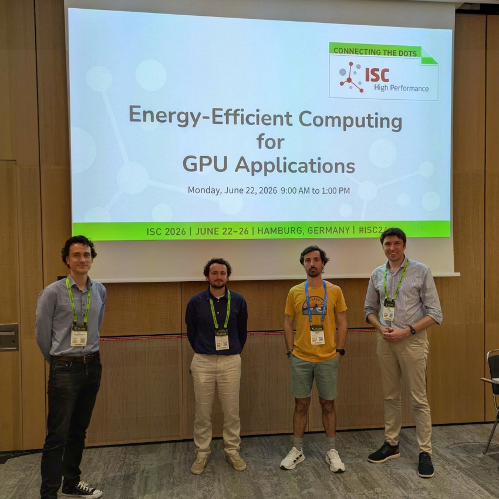
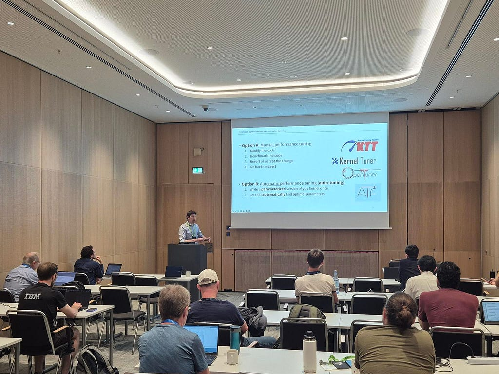
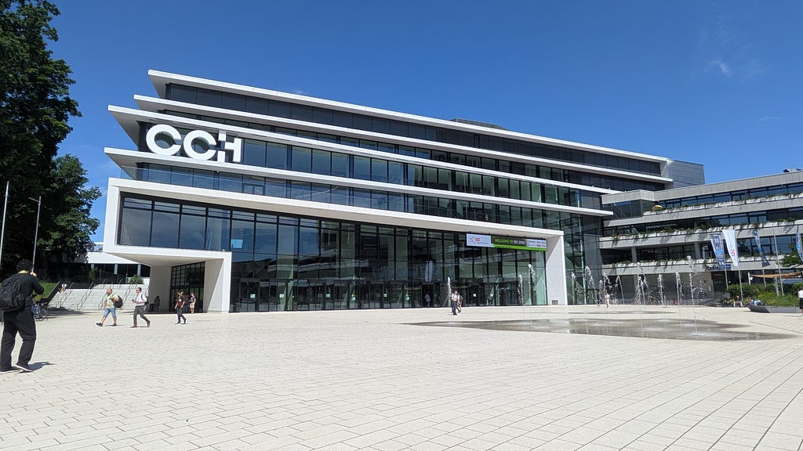
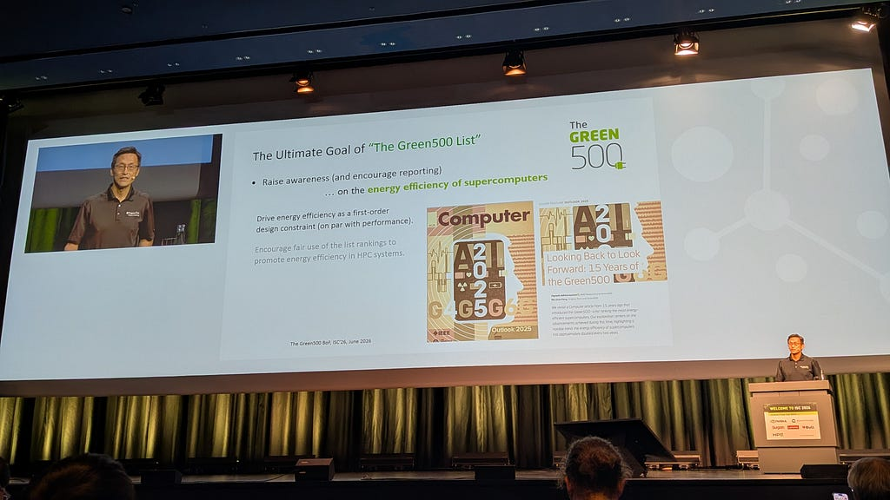
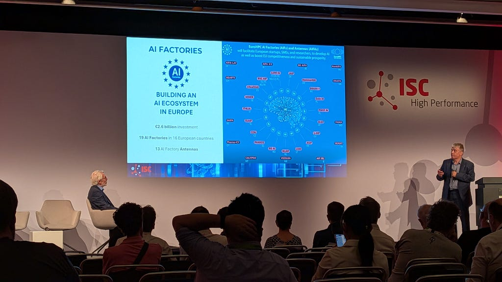
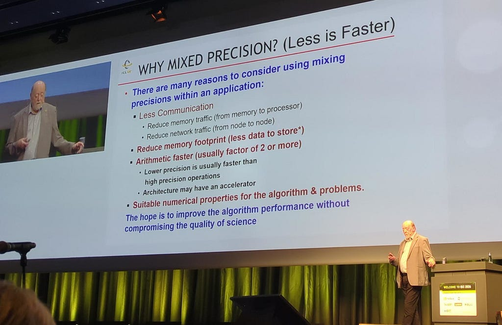
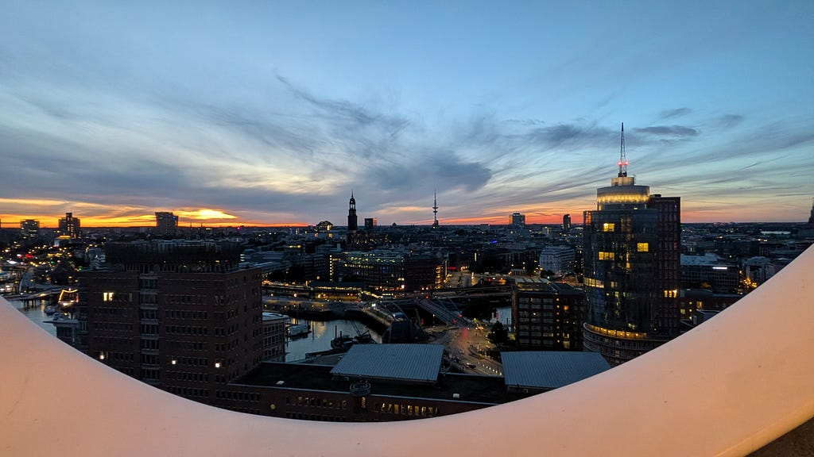

> GPUs power many of today’s large-scale scientific simulations, data analysis workflows, and AI applications. However, all that computing power comes at a huge cost: **energy usage**. As demand for compute continues to grow, energy efficiency is becoming just as important as performance. That makes a practical question increasingly important for the HPC community: how can we maximise the scientific output from every watt spent?

Each year around June, researchers, developers, vendors, and computing centres from across the HPC community gather in Hamburg for *ISC High Performance*, Europe’s leading conference and exhibition for high-performance computing, AI, and quantum technologies.

Figure 1: From left to right: Ben van Werkhoven (Leiden University), Skip Thijssen (Leiden University), Alessio Sclocco (NLeSC), Stijn Heldens (NLeSC)

This year, a team from the Netherlands eScience Center also made the trip to Germany for the 41st edition of ISC. Our goal was to deliver, in close collaboration with the [Accelerated Computing group from Leiden University](https://ac.liacs.nl/), a half-day tutorial on Energy-Efficient Computing for GPU Applications on the opening day of the conference week. Our tutorial focused on one simple question: how can you make GPU applications both faster and more energy efficient?

The tutorial was built around teaching several practical skills, combining short talks with hands-on sessions:

- **Code optimisation**: software-level techniques that directly improve the energy efficiency of GPU code.
- **Auto-tuning**: automatically exploring the space of implementation choices to find the best trade-off between performance and energy, using our open-source tool [Kernel Tuner](http://github.com/KernelTuner).
- **Mixed precision**: how to write reduced-precision GPU kernels using [Kernel Float](https://ac.liacs.nl/) to get more results per joule.
- **Hardware tuning**: measuring power consumption and finding the optimal range of GPU core clock frequencies.

Figure 2: Stijn Heldens presenting on auto-tuning for energy efficiency.

The key message of the day was: **measure, don’t assume**. The fastest configuration is not always the most energy efficient. The optimal choice depends on a delicate balance between the application, the hardware, and the accuracy requirements. Whether you are a research software engineer, an HPC specialist, a systems administrator, or a domain researcher, there are always opportunities to use less energy while getting more science out of your GPU.

Figure 3: Congress Center Hamburg (CCH), yearly venue of ISC-HPC.

Beyond the tutorial, ISC 2026 showed that energy efficiency has become a central topic in HPC. The headline news of the conference was *LineShine*, a CPU-only Chinese system that debuted at number one on the [TOP500](https://www.top500.org/), the list of the world’s 500 most powerful supercomputers. LineShine reached 2.2 exaflops (2.2 × 10¹⁸ floating-point operations per second) of sustained double-precision performance at 42.2 megawatts, giving it an energy efficiency of 52.07 gigaflops per watt. *JUPITER Booster* remained the fastest system in Europe, reaching exactly 1 exaflop with an efficiency of about 63.3 gigaflops per watt.

Figure 4: Prof. Wu Geng (Virginia Tech) introducing this year’s Green500 list.

Another announcement came from the [*Green500*](https://www.top500.org/lists/green500/green500-june-2026/), the list of the most energy-efficient systems in the world: for the first time in its history, the **top ten systems were unchanged** from the previous edition, with the leading system achieving 73.3 gigaflops per watt. This is another sign that future gains will have to come not only from new hardware, but also from how we program and operate the systems we already have.

Figure 5: Anders Dam Jensen (Executive director EuroHPC) on Europe’s future HPC and AI strategy.

AI was as prominent a theme at ISC as energy efficiency. Europe is betting big on artificial intelligence through the EuroHPC Joint Undertaking, with the EU and participating countries committing to a network of 19 *AI factories* across the continent (including one here in the Netherlands!), plus even larger *AI gigafactories* are in the works. But training the largest AI models demands enormous amounts of electricity, and increasingly it’s power, not chips, that limits how big these systems can grow.

Figure 6: Prof. Jack Dongarra (University of Tennessee) closing the main conference program.

The main conference program closed with an inspiring keynote by *Jack Dongarra*, Turing Award winner and one of the most influential figures in numerical linear algebra software, which has shaped much of modern HPC. His message was clear: **HPC is changing**. The field is moving beyond peak double-precision performance alone, toward systems and workflows that balance time, energy, accuracy, and scientific impact. Mixed precision, AI-assisted simulation, and better software will all play a critical role in this transition.

Figure 7: Hamburg at night, taken from the top of the *Elbphilharmonie.*

Overall, ISC 2026 made one thing clear: sustainable high-performance computing will require not only better hardware, but also better software, better tools, and close collaboration between researchers, research software engineers, and HPC experts. Energy-efficient GPU programming is not only a hardware challenge. It is also a software engineering challenge.

Want to try the tutorial yourself? All materials, including the hands-on notebooks, are freely available at: [github.com/KernelTuner/energy_efficiency_tutorial/](https://github.com/KernelTuner/energy_efficiency_tutorial/).

*This work was funded by the Netherlands eScience Center through SUNBEAM (OESC-25–1/4) and by the EuroHPC Joint Undertaking and national co-funding bodies through ESiWACE3 (grant agreement №101093054).*
