## A Representative Survey

The definition of Research Software Engineers (RSEs) is, according to the [website of the international RSE community](http://researchsoftware.org/):

> Research Software Engineers are people who combine professional software expertise with an understanding of research.

Defining the specifics, however is less straight-forward. How much of a researcher is somebody with 'an understanding of research'? How much 'professional software expertise' is there? To get a more fine-grained view, we have asked the people who know best: RSEs working in this profession.

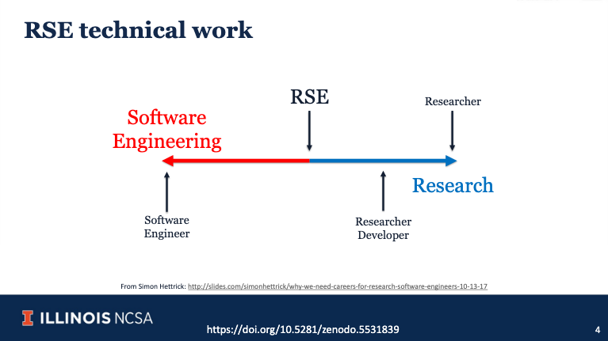
Source: [Katz et al., 2021](https://zenodo.org/record/5531839)

For a survey sent out to the 38 RSEs at the Netherlands eScience Center -- one of the largest institutions of Research Software Engineering in the world -- we have received 28 completed responses. This proportion gives statistically robust insights about how the RSEs NL eScience Center see their role.

## Engineer or Researcher?

The core of this survey is the question: "do you see yourself more as a software engineer or as a researcher?" The following chart also shows how they spend their time (discounting administrative and other work):

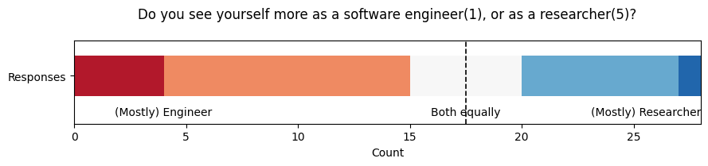

More than half of the participants (15) see themselves more as engineers (upper bar). 8 RSEs, on the other hand, position themselves towards the researcher's end of the scale. A clear majority on the engineering side, but the result is far from definitive.
When it comes to spending time, on the other hand, it is. A few RSEs divide their time equally, but most of them are mostly busy with software engineering. Whether this corresponds to their own preference? We look into that further below.

Let's first focus on the types of output that RSEs value more. The most important contribution for an engineer is software itself, whereas researchers traditionally mostly contribute to academic publications. These answers are not mutually exclusive, hence respondents can deem both software and academic output as equally important.

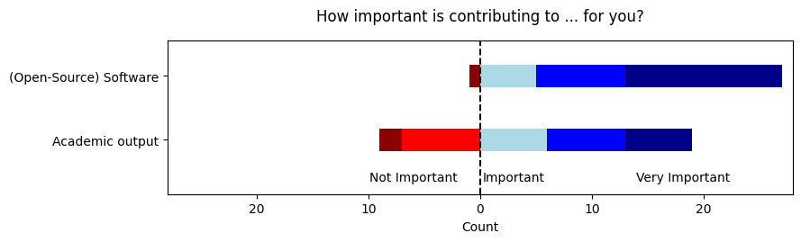

Nevertheless, there is a near-consensus among RSEs that software contributions are somewhat important (upper bar). For academic publications, this looks different: a third of the participants does not consider academic output as important part of their work (bottom bar).

At the same time, the RSEs see a difference between their own priorities and those of their employer. While the organisation's importance for software output roughly aligns with their own judgement, only two RSEs think that the eScience Center does not consider academic output important.

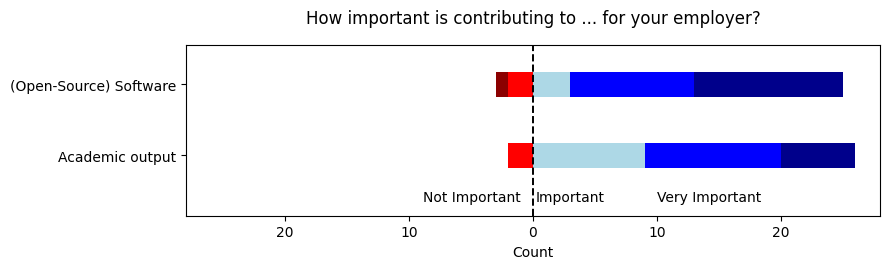

At the same time, roughly a third of the RSEs would prefer to spend more time with research. Another third of the group says the opposite: they would prefer to spend even more time with engineering.

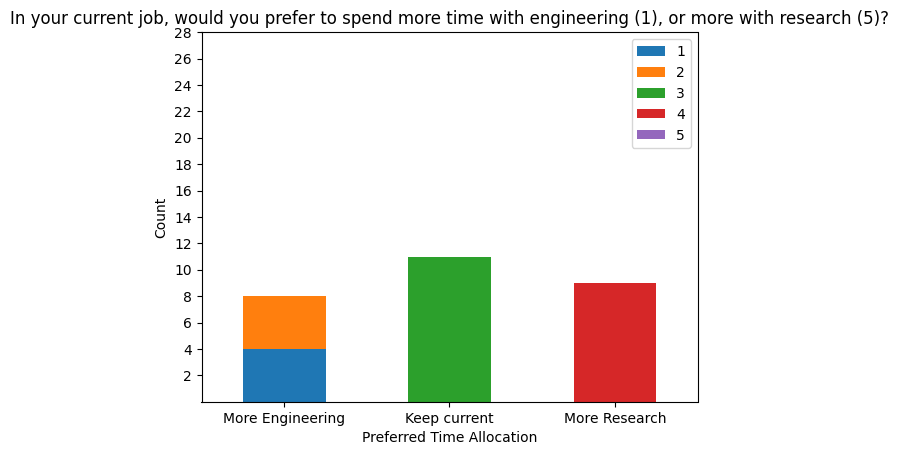

## Skills

Ideally, the tasks in a job align with the skills required for those tasks. In the self-perception of the NL eScience Center RSEs, this is not always the case. Again, we have asked the RSEs about the differences between software engineering and research, but in relation to their own qualification. In summary, all RSEs feel (highly) qualified for their engineering tasks. For research, thr group of highly qualified ones is slightly smaller, and a few RSEs even feel underqualified.

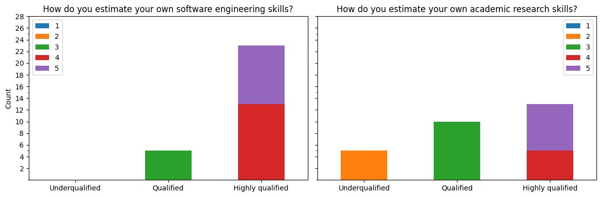

The next question zooms in to whether the respective skills of RSEs are sufficient for doing their job. In line with the self-estimated qualification, there is a large group that has more than sufficient skills for solving their engineering tasks. For the research tasks, the image looks similar: most RSEs feel over-qualified rather than lacking skills.

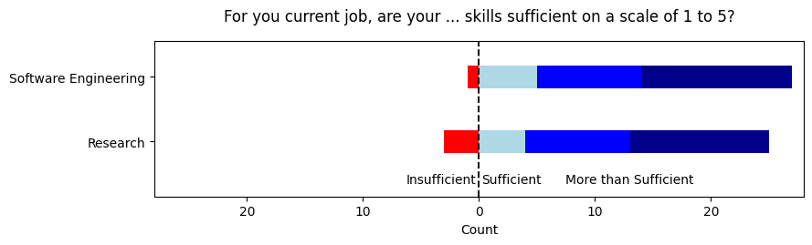

<!-- The high level of qualification on both software engineering and research, aligns with the Center's ambition to be the national center of research software expertise. For the engineering part in particular, it indicates that the bar could even be raised. -->

## Where do we come from?

While not being a requirement for the profession, almost two thirds of RSEs at the NL eScience Center has a PhD. Among the rest, most hold a Master's degree.

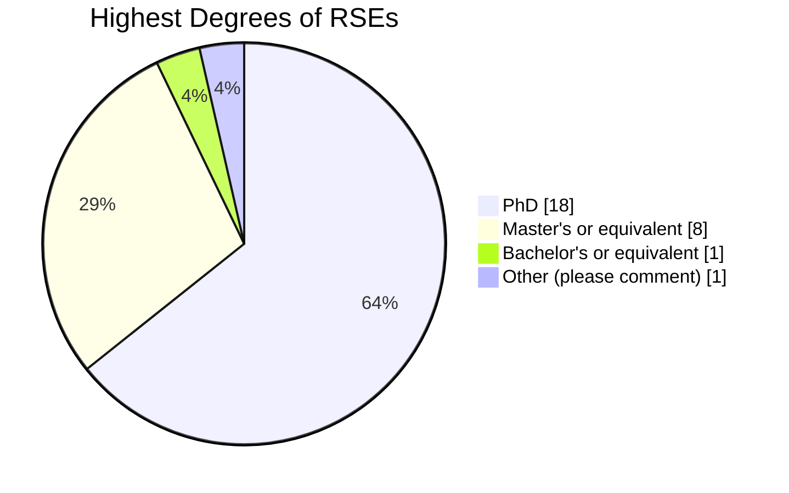

In the [global RSE Survey]((http://rse-survey.soton.ac.uk/superset/dashboard/p/2Kjmv91MxeB/)), the picture looks similar, albeit more scattered:

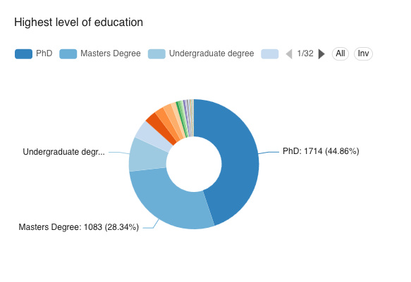

For the age distribution, we do not see much diversity either, with most RSEs being in the age group of 36 to 45 years of age.

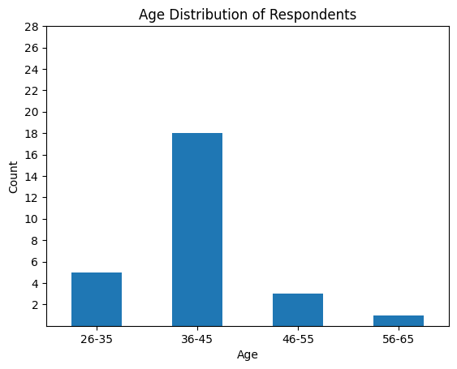

In [the global RSE community](http://rse-survey.soton.ac.uk/superset/dashboard/p/yxKPJp5mNgO/), the age distribution has roughly the same shape:

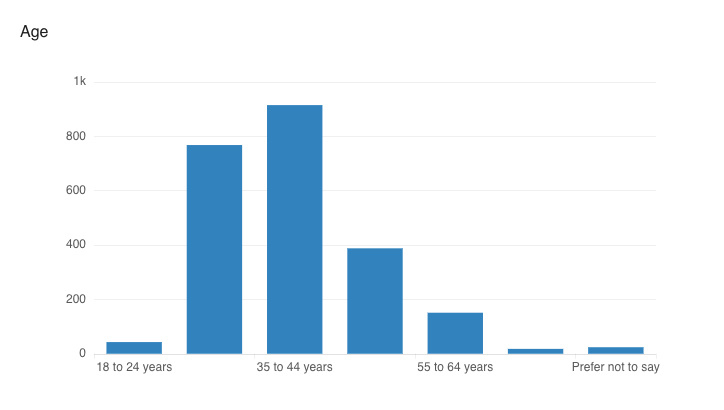

When it comes to specific subjects of study, on the other hand, we see a rather broad distribution. The group who studied Physics or a sub-discipline thereof is the largest, followed by Computer/Computational Science. Computational Linguistics and Artificial Intelligence are the only other subjects studied by more than a single RSE.

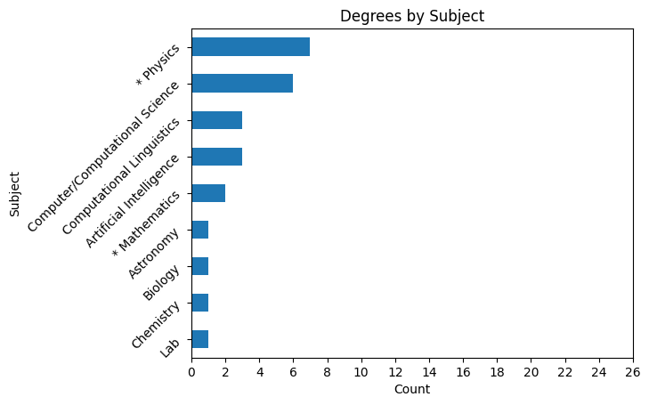

The distribution, however, appears less diverse when zooming out a bit: the proportion of _STEM_ subjects (_Science, technology, engineering, mathematics_) resembles election results seen in dictatorships: it comes close to 100%, even when considering Computational Linguistics as at least partly outside of the STEM category.
 Again, the [global RSE survey](http://rse-survey.soton.ac.uk/superset/dashboard/p/Wj3Pn9dZvqo/) shows almost the same tendency:

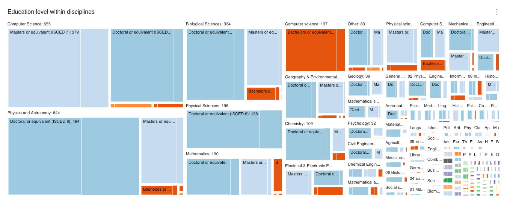

## ... and where do we go?

By the definition of this survey, all participants have the same current job title: Research Software Engineer. But we wanted to know about their previous roles as well as about their anticipated next job.
The following diagram shows the flow from previous jobs (left) to future jobs (right) of the surveyed RSEs.

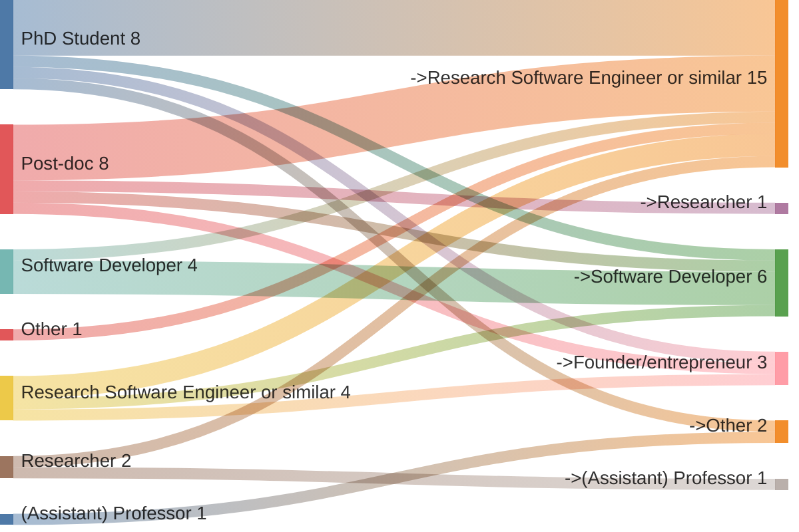

Interestingly, more than half of the RSEs do not hope for a change in their role: 15 of them anticipated RSE or similar as their next job as well. The second-largest group sees their future in a Software Developer position, presumably abandoning the research part of the RSE work. Other options like `Manager` and `Post-doc` did not get a single vote.
Apparently, there is no desire to go back to where they come from either. The vast majority of the RSEs comes from a PhD or Post-doc position, but only two RSEs express interest in pursuing another academic position in the future.

The same questions with a focus on the sector rather than the specific role confirms what we see above: two thirds of the RSEs come from an academic position. For the future, we clearly see that returning to academia has little appeal compared to industry or public sector jobs. Among the three 'Other' respondents, two did not wish to define a preferred sector while one explicitly specified 'Not academia'.

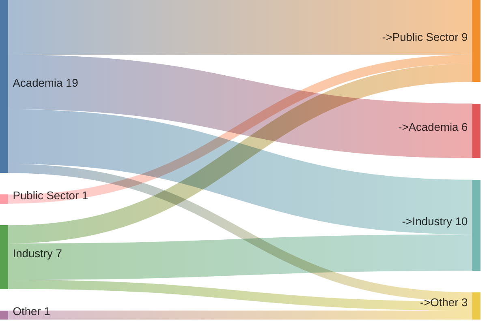

We also included a bit of trick question: what sector do you currently work in? It turns out that the RSEs of the eScience Center reflect the ambiguous position of the eScience Center between academia and public sector: their answers are distributed almost evenly:

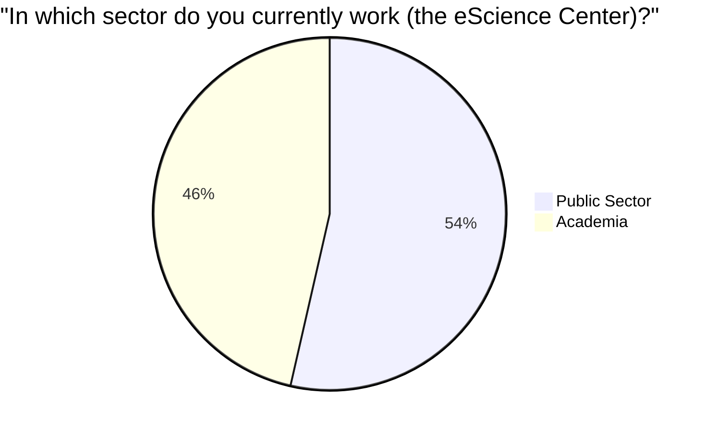

## Conclusions

Apart from the demographics, we can divide our survey into two main sections:

1. the distribution between software engineering and research, and
2. the career paths.

For the former, we see that most RSEs position themselves mostly as engineers and see themselves as better qualified for the respective tasks. In that regard, they see a slight misalignment between their own priorities and those of their employer that seems to value academic contributions higher than the RSEs do. That being said, however, there is also a significant minority that tends towards the research side of the spectrum.

Looking at the career path: most RSEs come from an academic background and have joined the eScience Center after doing a PhD or a Post-doc. At the same time, almost none of them would like to go back to an academic position. Most prefer to stay RSEs, with some showing interest in a future as software developers.

However, a survey among RSEs creates a blind spot regarding former RSEs that have left the profession. The results indicate that the respondents are RSEs by choice and are not planning to pursue other career paths as a next step. They do not provide insights about those who have chosen a different role.

Compared to the [RSE Survey](https://www.software.ac.uk/news/rse-survey-data-release) that is run globally by the [Software Sustainability Institute](https://www.software.ac.uk/) every year, the advantage of this smaller survey lies in its representativeness, albeit for a smaller community. Individual outliers could have a larger statistical impact here, but a larger survey is not immune to biases either as it relies on a smaller, not necessarily statistically representative proportion of their total target audience.

The comparisons between the two surveys have revealed very similar demographics between the eScience Center and the global RSE community. Apart from the age group and the education levels, this also applies to the gender distribution that we have not even included for the eScience Center because its distribution is even more extremely skewed than in the [global RSE survey](http://rse-survey.soton.ac.uk/superset/dashboard/p/eAgPq9lPj2J/).

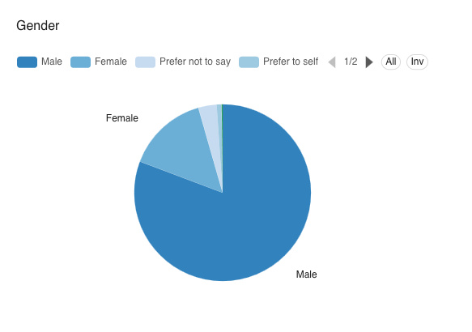

## Data Publishing

The dataset is small enough to allow de-anonymisation. Skewed categories like gender and education in combination with a small total number of rows make it possible to identify individual survey participants. Publishing such a dataset would therefore leak private data and is therefore not desired, nor legal (cf. [GDPR](https://gdpr.eu/)). Before we publish the raw survey data, we have to find a validated way to do so without compromising the privacy of the participants.
