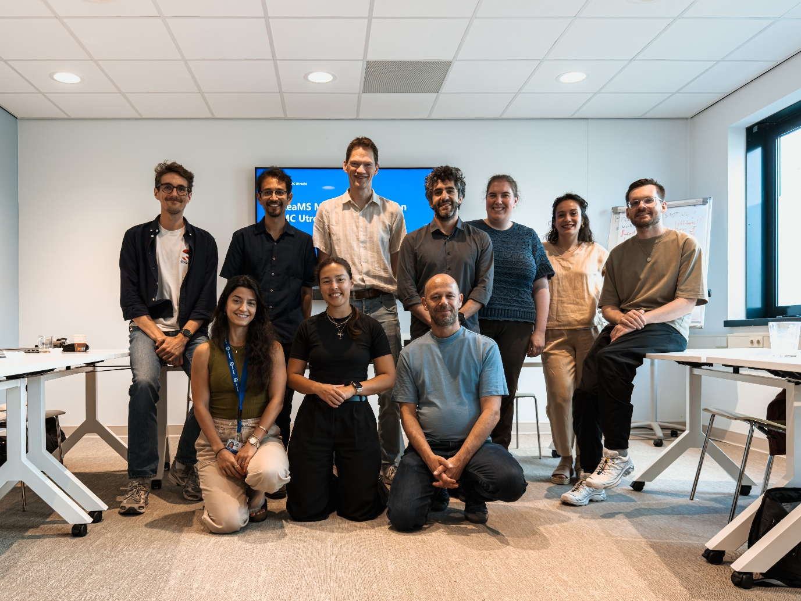

Following the success of our previous in-person DReaMS meetups, it
became clear that there was both enthusiasm and a genuine need for
continued exchange between Research Software Management (RSM)
professionals across the Dutch University Medical Centers (UMCs).
Previous gatherings demonstrated the value of sharing experiences,
discussing common challenges, and learning from each other's approaches.
As a result, we decided to continue the conversation and held our next
community meeting on **3 June 2026**, hosted by **UMC Utrecht**.

DReaMS meetup participants. Picture by Sara Mahdavi Hezavehi

The meeting brought together representatives from several Dutch UMCs,
alongside colleagues from the Netherlands eScience Center and Health-RI.
Similar to previous meetings, the atmosphere was open and collaborative,
with participants eager to exchange ideas and identify opportunities for
alignment across institutions.

**Community Updates: Shared Challenges, Shared Opportunities**

The first hour was dedicated to updates from participating
organizations: UMCU, LUMC, AUMC, UMCG, and eScience Center, each sharing
their current initiatives and priorities.

**1. Software Management Plans continue to gain traction**

Software Management Plans (SMPs) were a recurring topic across
institutions. UMC Utrecht shared experiences with implementing SMPs
through DMPonline, while LUMC reported ongoing work on SMP SMP templates
in [DS-Wizard](https://ds-wizard.org/),
and AUMC on using the ELIXIR-STEERS SMP ([Hancock et al.,
2026](https://doi.org/10.5281/zenodo.16962445)),
also using DS-Wizard, by building on work by [Suchánek et al.
(2023)](https://doi.org/10.37044/osf.io/t94g8) .
For a brief report on AUMC's SMP activities, see [van der Velde & Pronk
(2026)](https://doi.org/10.5281/zenodo.20813658).
An introduction on the development of SMP at LUMC is available at
[Introducing Software Management Plans at LUMC |
Zenodo](https://zenodo.org/records/20595743), and LUMC SMP knowledge
model for DSW is available at [LUMC-DCC/sciwiz-smp-km: Knowledge Model
for creating Software Management
Plans](https://github.com/LUMC-DCC/sciwiz-smp-km/).

The discussion highlighted a shared interest in harmonizing approaches
where possible, while recognizing that different use cases may require
different implementations and tools.

**2. Training and community building remain important priorities**

Many institutions reported training-related initiatives, ranging from
Git and version-control training to coding cafés, software curation
courses, and support for research software engineering skills.

Participants exchanged experiences about engaging researchers and
developers in these activities. While interest in training remains high,
several attendees noted that building sustainable local communities and
encouraging participation can still be challenging. This led to valuable
discussions about audience needs, event formats, and ways to increase
visibility within institutions.

**3. Version control, licensing, and intellectual property**

Another common theme was support for version control, software
publication, licensing, and intellectual property considerations.

UMC Utrecht shared ongoing work around Git guidelines, licensing,
copyright, and software publication practices. Similar topics emerged in
updates from other institutions, confirming that legal and governance
questions remain important parts of research software management
support.

**4. Update from eScience Center**

eScience Center representative Carlos Martinez updated us on current and
upcoming funding and talent development opportunities, including the
[Research Software Sustainability
Fellows](https://www.esciencecenter.nl/calls-for-proposals/call-for-research-software-sustainability-fellows-rssf-2026/)
(RSSF 2026) call, as well as future initiatives such as a proposed
Engineering Doctorate (EngD) programme focused on research software,
data/AI, and scientific infrastructure. The update also highlighted
developments around the Research Software Directory (RSD), with ongoing
efforts to improve federation, integration, standardization, and
training to strengthen interoperability between software registries and
repositories and increase the visibility and sustainability of research
software

**Spotlight Discussion: SMPs**

Following the coffee break, the group held a dedicated discussion on
SMPs.

Participants exchanged experiences with different platforms and
approaches, including DMPonline, DS-Wizard, and more traditional
document-based workflows. The conversation focused not only on tooling
but also on the broader question of what information SMPs should contain
and how they can best support researchers throughout the software
lifecycle.

Several interesting topics emerged:

- Whether SMPs should be treated as living documents that evolve
  throughout a project's lifetime.

- Opportunities for machine actionable SMPs and integration with
  existing metadata and registry initiatives.

- The balance between institutional requirements and community-wide
  harmonization.

The discussion also highlighted a shared interest in harmonizing
approaches where possible, while recognizing that different use cases
may require different implementations and tools.

Participants noted that each UMC approached the topic from a different
perspective, including FAIR and Open Science, IT security, and
regulatory compliance. Consequently, SMPs were often developed with
different objectives in mind. For example, software developed as a
medical device may require different considerations than software where
security is the primary focus. Rather than enforcing a single template,
there was interest in making a collection of SMP templates and examples
available in a shared location, allowing researchers and support staff
to select the most appropriate starting point for their specific context
and requirements.

While no single solution fits every context, the discussion reinforced
the value of continued collaboration and knowledge sharing between UMCs
on this rapidly developing topic.

**Looking Ahead: Where Does DReaMS Belong?**

The second major discussion of the day was led by **Thomas Pronk**, who
invited the community to reflect on the future positioning of DReaMS
within the broader Dutch and international research software landscape.

Participants had to reflect on an important question: should the
community remain fully independent, or would closer alignment with
larger initiatives provide additional opportunities and long-term
sustainability?

The discussion explored possible connections with organizations and
networks such as **ELIXIR-NL** and **NL-RSE**, while emphasizing that
DReaMS' strength lies in its practical focus and active exchange between
Dutch UMCs.

A clear consensus emerged: rather than focusing on formal organizational
integration, participants preferred to align around shared goals,
activities, and content. At the same time, there was broad recognition
that some degree of organizational support can help ensure continuity,
coordination, and community management in the longer term.

As a concrete next step, the group agreed to further explore
collaboration opportunities with **NL-RSE**, potentially through jointly
organized events and activities focused on research software within the
health domain.

Another important topic was the scope of the community itself.

Participants expressed a strong desire to keep DReaMS focused on the
Dutch UMC ecosystem, where many challenges and organizational contexts
are shared. At the same time, there was enthusiasm for fostering broader
conversations and welcoming external participants when topics overlap
with their expertise and interests.

To support this, the community agreed that future meeting agendas should
be published in advance, alongside information on how interested
colleagues outside the immediate network can join selected discussions.

**Continuing the Conversation**

The June meeting once again demonstrated the value of bringing together
professionals working at the intersection of research software, data
stewardship, and research support. Across discussions on SMPs, training,
licensing, software publication, and community sustainability, a common
theme emerged: many institutions are facing similar challenges, and
there is significant benefit in addressing them together.

We, the **UMC Utrecht,** would like to thank all participants for
joining and their contributions to this meeting. We look forward to
continuing these conversations and strengthening the DReaMS community in
the months ahead.
