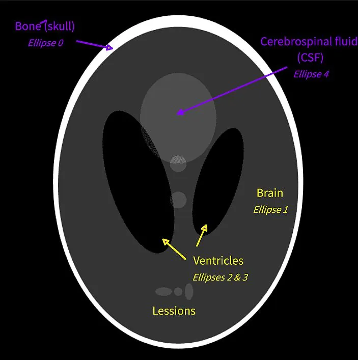
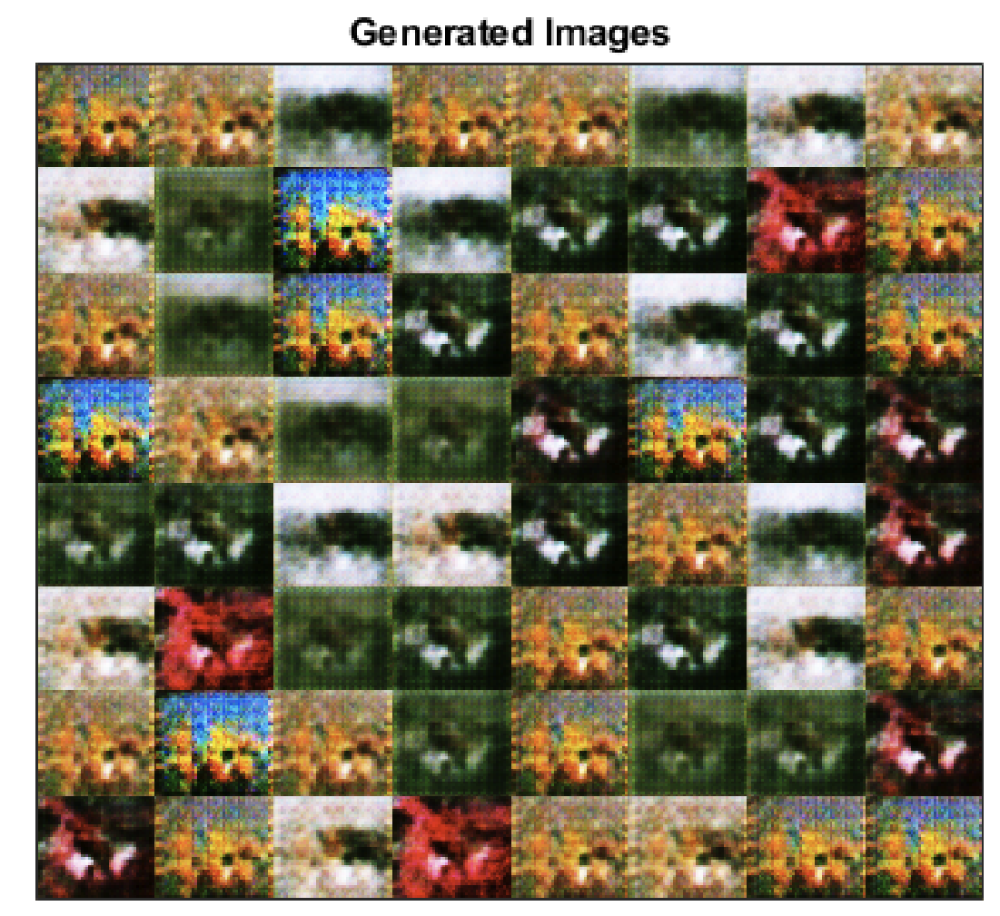
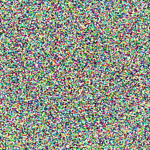
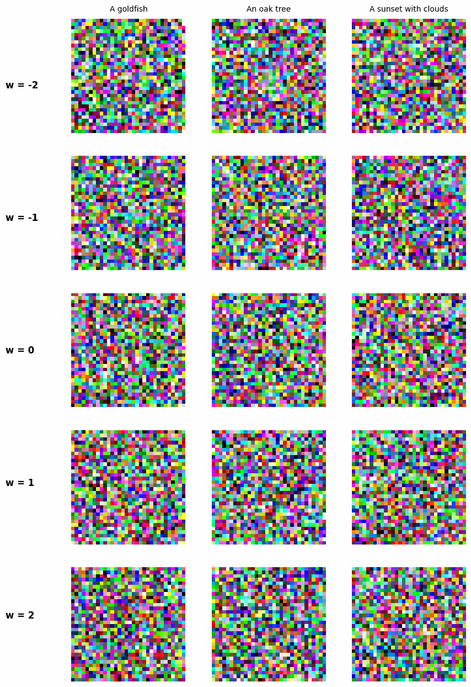
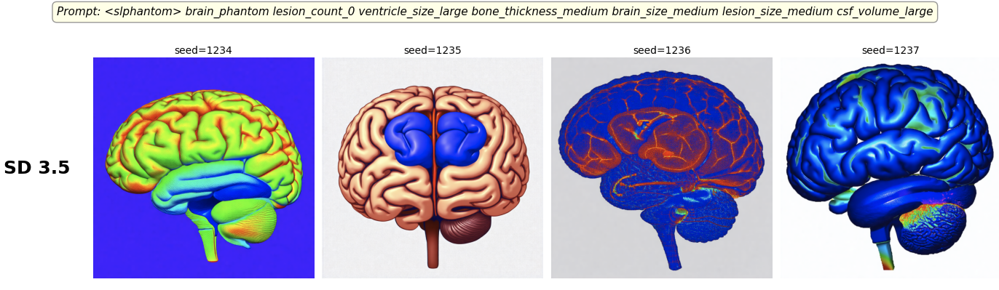
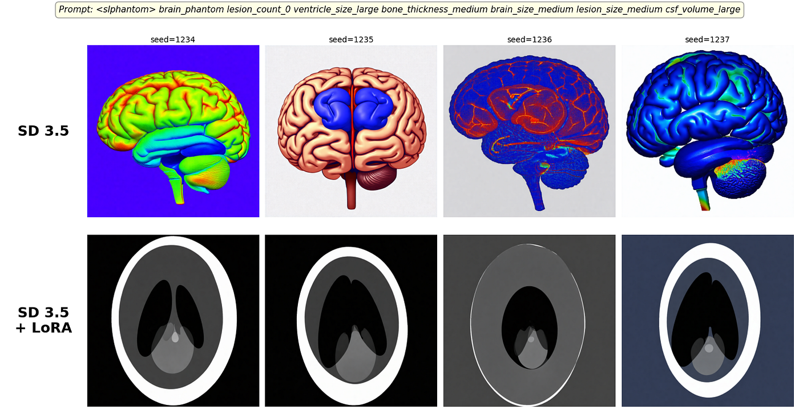
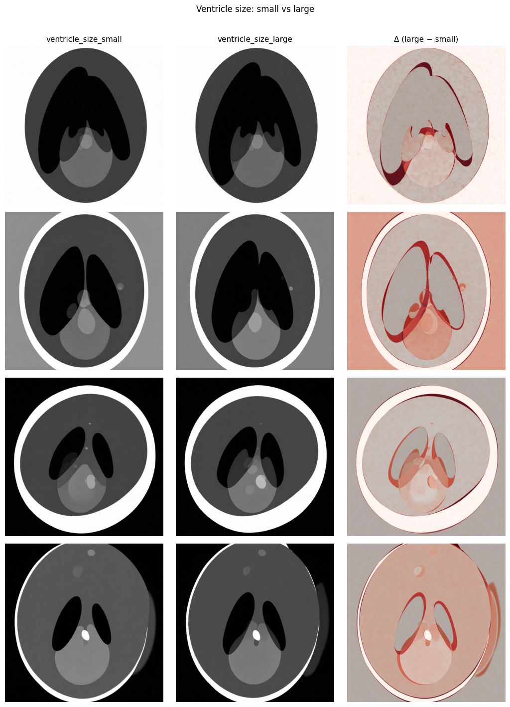

*This is a story about why we stopped writing data collection scripts and started training generative models instead, and how Hugging Face made it actually possible.*

## The Problem That Started Everything

Imagine you are building a machine learning model to detect subtle abnormalities in brain MRI scans like lesions, enlarged ventricles, changes in the central cerebrospinal fluid space. You have a handful of annotated images from clinical partners, a lot of knowledge, but you are stuck with a very real problem: there is simply not enough labeled data to train a robust model.

You could ask radiologists to annotate more scans. That takes months and costs a fortune. You could use data augmentation (flipping, rotating, adjusting contrast). But augmentation only stretches what you already have; it cannot invent the kind of distributional diversity that makes a model generalizable.

There is actually a third option that the medical imaging community has known about for decades: the ****Shepp-Logan phantom****. Originally introduced in 1974 to benchmark CT reconstruction algorithms, the Shepp-Logan phantom is a mathematical model of a brain cross-section consisting of a set of ellipses with defined positions, sizes, and intensities that approximate the major anatomical structures you would see in an MRI slice: the brain outline, ventricles, grey and white matter regions. You can generate a Shepp-Logan image instantly, at any resolution, with perfect ground-truth labels, and at zero cost.

<figure>

<figcaption>This is a Shepp-Logan phantom model that captures the structure of a MRI scan. The problem is that it is deterministic, so we can not really use it to mimic the natural variety of a brain scan.</figcaption>
</figure>

The problem is that it is **completely deterministic**. Every image it produces is the same. You can tweak the ellipse parameters by hand to simulate mild anatomical variation, but you are still in a rigid, low-dimensional space; nothing like the genuine biological variability of a real patient population. A model trained only on Shepp-Logan phantoms learns to recognize a geometric caricature of a brain, not a brain. The distribution gap between the phantom world and clinical data is large enough that models trained on it tend to fail the moment they see a real scan.

What if you could teach a model to **create** new brain scans, ones that look like real MRIs but carry the controlled, labeled structure of a phantom?

That is exactly what this project explores. We use AI to generate a diverse family of synthetic phantom-like images, varied enough to train a robust detector, controlled enough to carry reliable labels, by fine-tuning a large pretrained diffusion model on our small set of domain images. And the answer led us deep into the world of diffusion models, and to a workflow that is now entirely reproducible, open, and practical for anyone with a similar problem and a GPU.

## The Road to Good Generative Models

### The First Attempt: GANs and the Problem with Adversarial Training

The natural first instinct when you need to generate images is to actually have a model trained to produce images. This is easier said than done, because such a model is extremely hard to train. Probably the first decent result was achieved by **Generative Adversarial Networks** (GANs). The idea is straightforward: since one network is not good enough, put two networks against each other. A *generator* that produces fake images from random noise and a *discriminator* that tries to tell them apart from real ones. Through competition, the generator learns to produce increasingly convincing images.

For a while, this worked remarkably well, GANs dominated the field and produced some genuinely impressive results. But if you have ever tried to train one on your own domain data, you have probably run into the wall: **training instability**. The generator and discriminator need to stay in a careful balance. If the discriminator becomes too strong too fast, the generator gets no useful gradients and stops learning (you get a <a href="https://arxiv.org/pdf/1701.04862" target="_blank">vanishing gradient</a>). If the generator finds a single convincing mode, it exploits it (a phenomenon called <a href="https://arxiv.org/pdf/1701.07875" target="_blank"><em>mode collapse</em></a>), and you end up with a model that generates the same image regardless of the input noise. Getting a GAN to produce diverse, high-quality outputs reliably requires a lot of architecture tricks, careful hyperparameter tuning, and often just luck.

<figure>



<figcaption>Example of GAN’s mode collapse from <a href="https://nl.mathworks.com/help/deeplearning/ug/monitor-gan-training-progress-and-identify-common-failure-modes.html" target="_blank">this tutorial</a>. You can see how the model is collapsed to the same pattern.</figcaption>
</figure>

For our brain MRI problem, this means GANs are risky. They might produce sharp-looking images, but with a small domain-specific dataset, you are very likely to get collapse or outputs that recycle the same few anatomy patterns. That is not a useful data generator.

### The Elegant Alternative: Teaching a Model to Undo Noise

Diffusion models take an entirely different approach, which is both physically intuitive and mathematically stable.

The core idea is: instead of training a network to generate an image in one shot (as GANs do), train it to *undo a tiny bit of noise*. Repeatedly. Why should this work? Because our universe follows very similar rules in non-equilibrium thermodynamics, so we are basically designing an algorithm that generates images like how the universe reaches thermodynamic equilibrium.

Think of a drop of ink falling into a glass of water. Left alone, it spreads until the color is uniform (maximum entropy, no structure). That spreading is the *forward* diffusion process: each moment is a tiny, local, random step. What diffusion models learn is the *reverse*: given a slightly blurred snapshot, predict the direction from which the ink came. Do that thousands of times in sequence and you reconstruct the original drop (or, in our case, a coherent image) from what looked like pure noise. The beauty is that there are many valid paths back: reverse slightly differently each time and you land on a different ink drop, but one that is still coherent. That variability is not a bug, but it is exactly what gives diffusion models their generative power!

During training, you take a real image and progressively corrupt it by adding small amounts of Gaussian noise over many steps $t$, following a fixed schedule $\beta_{1},\beta_{2},\cdots,\beta_{T}$​:

$$
q\left(\bold{x}_{t}|\bold{x}_{t-1}\right) = \mathcal{N}\left(\bold{x}_{t}\bold{;}\sqrt{1-\beta_{t}}\bold{x}_{t-1}\bold{,}\beta_{t}\bold{I}\right)
$$

After enough steps, the image becomes indistinguishable from pure Gaussian noise. A neural network — in the classic formulation, a U-Net with time embeddings so it knows *which* step it is at — is then trained to predict the noise that was added at each step. And what is the loss function? An <a href="https://arxiv.org/pdf/2006.11239" target="_blank">excellent and simple choice</a> is to just use MSE between the real noise and the predicted noise:

$$
\mathcal{L} = \mathbb{E}_{t,x_{0},\bold{\epsilon}}\left[\lVert\bold{\epsilon} - \bold{\epsilon}_{\theta}\left(\bold{x}_{t}\bold{,}t\right)\rVert^{2}\right]
$$

You can find a fantastic mathematical explanation <a href="https://lilianweng.github.io/posts/2021-07-11-diffusion-models/#speed-up-diffusion-model-sampling" target="_blank">in this blogpost</a>.

Then once the model is trained, at inference time, you start from pure random noise and run the reverse process: at each step, the network predicts what noise was added and subtracts it. After 20–50 steps, you land on a sample that looks like it came from the training distribution.

<figure>



<figcaption>Diffusion model in the process of generating a ‘Shepp-Logan phantom model of a MRI’. While the final results is a clean representation of a brain, this is far from being a good replacement for a MRI scan.</figcaption>
</figure>

## From Noise to Prompt: Steering Generation with Text

So far we have a model that generates *something* from noise, but not necessarily *anything specific*. So ideally, we need to steer the reverse process with a prompt.

The naive approach would be to train a separate image classifier p(c∣x) to score how well an image matches a given description, and at each denoising step nudge the generation in the direction of increasing classifier probability. This is called **classifier guidance**. It works, but it is awkward: the classifier must operate on noisy, partially denoised images at every timestep, you have to backpropagate through it at inference time, and you need to retrain it separately for every domain and condition you care about.

The elegant solution is **classifier-free guidance** (CFG), introduced by <a href="https://arxiv.org/abs/2207.12598" target="_blank">Ho &amp; Salimans (2022)</a>. The key insight: instead of training a separate classifier, *teach the diffusion model itself to be its own classifier*. During training, the text condition is randomly dropped with some probability; sometimes the model sees the prompt, sometimes it sees an empty string. This forces it to learn both a conditional noise prediction ϵθ(xt,t,c) and an unconditional one ϵθ(xt,t,∅) within the same set of weights.

At inference time, you run both predictions simultaneously and extrapolate *away* from the unconditional and *toward* the conditional:

$$
\tilde{\bold{\epsilon}}_{\theta}\left(\bold{x}_{t}\bold{,}t\bold{,}c\right) =
\bold{\epsilon}_{\theta}\left(\bold{x}_{t}\bold{,}t\bold{,}\empty\right) + w\cdot\left(\bold{\epsilon}_{\theta}\left(\bold{x}_{t}\bold{,}t\bold{,}c\right) - \bold{\epsilon}_{\theta}\left(\bold{x}_{t}\bold{,}t\bold{,}\empty\right)\right)
$$

Here w is the **guidance scale**, a number you set at inference time, typically between 3 and 15. When w=0 you recover unconditional generation. Setting w&gt;0 concentrates sampling in the tight sub-region of that manifold consistent with your prompt, so you amplify the pull of the prompt at the cost of some sample diversity. Set it too high (w≳20) and you leave the manifold altogether and outputs become saturated and artifact-ridden.

This is also why prompt phrasing matters more than it might seem. The condition c is not passed as raw characters, but it is encoded by a language model (like <a href="https://github.com/openai/CLIP" target="_blank">CLIP</a>) into a dense embedding, and that embedding is cross-attended into the denoising network at every step. Tokens that map to well-represented concepts in the encoder’s training data steer cleanly; rare domain-specific terms may encode weakly, limiting their effect. This is precisely why fine-tuning helps: a trigger token like `<SheppLogan_phantom_model>` means nothing to a pretrained encoder, but after LoRA training (spoiler!) the model learns to associate it with the specific distribution of your data, giving you a reliable handle on the style you care about.

## Great Idea, but Hard to Build From Scratch.

At this point you might be thinking: “alright, I’ll implement this myself.” And you *can*. A basic DDPM U-Net with time embeddings, a noise prediction loss, and a frozen CLIP encoder for CFG is a few hundred lines of PyTorch, and a genuine learning experience <a href="https://github.com/NLeSC-Knowledge-Development/xNoise/tree/main" target="_blank">worth doing</a> if you want to build real intuition for what is happening inside these models.

But building a toy is not the same as building something useful. The moment you try to go from “works on simple examples” to “reliably generates realistic domain-specific images,” you run into a wall of compounding problems. You need data, and not just any data, but data that is representative of the distribution you actually care about, which in specialized domains like medical imaging is precisely what you do not have. You need infrastructure: GPUs, storage, a training loop that does not crash after twelve hours. You have a large space of hyperparameters: noise schedules, learning rates, model capacity, conditioning dropout rates, ecc. where the right combination is rarely obvious and wrong choices cost you training runs rather than just bad accuracy numbers. And training is slow: a single run to figure out whether your setup produces anything meaningful can take hours or days, which makes iteration expensive.

The time you spend debugging your custom training loop is time not spent on the actual problem: generating useful synthetic data. That trade-off only gets worse as the research moves forward and your hand-rolled infrastructure falls further behind.

<figure>


<figcaption>Classifier-free diffusion implemented from scratch. A lot of good experience but not the best results overall</figcaption>
</figure>

## Stable Diffusion and the Hugging Face Ecosystem

The other shift that makes all of this practical is the availability of large, openly released **pretrained** diffusion models. Training a competitive text-to-image model from scratch requires datasets of billions of image-text pairs and weeks of compute on hundreds of GPUs, simply not a realistic option for most research groups. But several organizations have released their best models publicly: Stability AI with the Stable Diffusion series, Black Forest Labs with FLUX, and others. These models encode an enormous amount of visual and semantic knowledge that you can build on rather than replicate. In this project we use **Stable Diffusion 3.5 Medium** (SD 3.5), one of the most capable openly available text-to-image models, which we will fine-tune on our domain data.

The tooling to work with these models has also matured rapidly, and this is where **Hugging Face** comes in. It is not the only ecosystem out there, but it is the most widely used and, crucially, the one we rely on throughout this project. What makes it particularly convenient is that all its libraries are maintained by the same organization, versioned together, and designed to interoperate — you are not gluing independently-maintained projects together and hoping for the best. The four libraries we use are:

- **`diffusers`** — unified pipeline API for diffusion models, with schedulers as pluggable components and training utilities included.
- **`transformers`** — text encoders (CLIP, T5, and others) that slot directly into the pipelines.
- **`accelerate`** — wraps your training loop so the same script runs on one GPU or a full cluster, handling mixed precision and gradient accumulation transparently.
- **`peft`** — adapter-based fine-tuning methods that let you update only a small fraction of model parameters rather than retraining the full model from scratch.

That last one deserves more explanation.

## Fine-Tuning Without Catastrophic Forgetting: LoRA

Even once you have access to one of these large pretrained models, you still face the adaptation problem: fully retraining billions of parameters on your small domain dataset is prohibitively expensive in compute and memory, and would almost certainly destroy the general knowledge the model already has, a phenomenon known as **catastrophic forgetting**.

**LoRA** (Low-Rank Adaptation, <a href="https://arxiv.org/abs/2106.09685" target="_blank">Hu et al. 2021</a>) solves this elegantly. The key observation is that the weight updates needed for domain fine-tuning tend to have low *intrinsic dimensionality*: you only need to change a small subset of weights. LoRA exploits this by freezing all original model weights and injecting a pair of small trainable matrices AA and BB alongside each target weight matrix $W$:

$$
W^{\prime} = W + \Delta{W} = W + \frac{\alpha}{r}BA
$$

where $r$ is the **rank** (a small integer, typically 4–64) and αα is a scaling factor. Instead of updating $W\in\mathbb{R}^{d\times{k}}$ directly, you only train $A\in\mathbb{R}^{r\times{k}}$ and $B\in\mathbb{R}^{d\times{r}}$. For $r\ll{d}$, this reduces the number of trainable parameters from billions to millions, while leaving the base model completely intact.

The practical payoff is substantial: training is fast enough to run on a single GPU in a few hours, the resulting adapter is a small file (tens of megabytes vs. several gigabytes for the full model), and you can trivially swap adapters at inference time to switch between domains without reloading the base model. The base model’s general knowledge is preserved exactly, and only the low-rank delta layers pull generation toward your domain.

## Putting It Together: Fine-Tuning SD 3.5 on Your Data

We now have all the pieces: diffusion models that generate from noise, classifier-free guidance that steers generation with text, SD 3.5 as a powerful pretrained starting point, and LoRA as a way to adapt it cheaply without destroying what it already knows. What does this look like in practice? The <a href="https://github.com/NLeSC-Knowledge-Development/fine-data-generation" target="_blank">repository accompanying this post</a> contains a fully worked example for brain MRI generation, including a training notebook and an explainability notebook, if you want something concrete to follow along with. Here we focus on the conceptual steps and the decisions that matter.

## Start by Understanding What You Already Have

The first step is not writing training code, but instead you should test the base model. In fact, something like SD 3.5 has seen an enormous range of images during pretraining, so before assuming you need to fine-tune at all, run your target prompts against the unmodified model across several seeds and look at what comes out. Sometimes the base model is closer than you expect, and the real problem is in how you are phrasing the prompt. Other times the gap is immediately obvious: the model has no concept of your domain and produces plausible-looking but structurally wrong images. Either answer is useful before you commit GPU hours.

<figure>



<figcaption>Can the pretrained mode (SD 3.5) already generate something useful? In our example no! It has no concept of a Shepp-Logan phantom model, so it just renders some random brains.</figcaption>
</figure>

## Preparing Your Data

For captioned LoRA training, the recommended data format is straightforward: a folder of images paired with a `metadata.jsonl` file containing one caption per image. The captions are the primary steering mechanism: they are what the model uses to link visual features to language during fine-tuning. For specialized domains, a key technique is the **trigger token**: a short, unique string that the base model’s text encoder maps to nothing useful, but which the LoRA learns to associate with the specific distribution of your data.

In the brain phantom case we use `<slphantom>` as the trigger token, followed by a structured sequence of semantic attributes describing the anatomical characteristics of each image. A concrete example from our dataset:

```json
{"file_name": "phantom_0001.png", "text": " brain_phantom lesion_count_1 ventricle_size_large bone_thickness_small brain_size_large lesion_size_small csf_volume_small"}
{"file_name": "phantom_0002.png", "text": " brain_phantom lesion_count_3 ventricle_size_small bone_thickness_large brain_size_small lesion_size_large csf_volume_large"}
```

Each attribute token (e.g., `ventricle_size_large`, `lesion_count_1`) is independently meaningful and maps to a measurable property of the image. The trigger token `<slphantom>` anchors the distribution to the Shepp-Logan phantom style, while the remaining tokens steer the specific anatomy. At inference time, including the trigger token reliably activates the adapted style, while the attribute tokens control the semantics you care about. If you do not have per-image captions, a simpler fallback is DreamBooth mode (a single instance prompt for every image) though this gives you less control over semantic variation at generation time.

## The Key Training Decisions

The hyperparameter space for LoRA fine-tuning is manageable, but a few choices matter substantially:

**Rank.** The LoRA rank rr controls how expressive the low-rank update can be. Values of 4–16 are common for style transfer, where the update is shallow. For domain adaptation, where the model needs to learn structural specific details, higher ranks (32–64) tend to work better. The cost is a slightly larger adapter file and more VRAM during training, both usually acceptable trade-offs.

**Resolution.** VRAM usage scales quadratically with resolution, so doubling the image size quadruples the memory cost of the attention maps. A good starting point is 512×512, stepping up to 768 or 1024 if your GPU can handle it and your images have details that matter at fine scales.

**Training length.** With a small domain dataset, overfitting is a real risk. Running with intermediate checkpoints (e.g., every 500 steps over a 2000-step run) lets you compare adaptation trajectories rather than committing to a single endpoint. The right stopping point is when the model has absorbed the domain style but the outputs have not started recycling from the training images.

## Evaluating the Result

After training, evaluation is a structured comparison: load the LoRA adapter and generate the same prompts at the same seeds with the base model and the fine-tuned model side by side. The visual diff tells you whether the model has moved toward your domain and whether the adaptation is coherent across seeds.

<figure>



<figcaption>Samples generated with and without LoRA. With LoRA, the model can generate something useful.</figcaption>
</figure>

## Sanity-Checking What the Model Actually Learned

Visual similarity to your training distribution is necessary but not sufficient. The more revealing test is **prompt-swap explainability**: generate an image, change one semantically meaningful phrase in the prompt, regenerate with the same seed, and compute a pixel-level difference heatmap.

For example: generate “normal-sized lateral ventricles,” then regenerate “enlarged lateral ventricles” — same seed, same everything else. If the heatmap activates over the ventricular region, the model has learned a genuine anatomical correspondence. If it lights up randomly, the visual change is noise rather than a semantic edit.

In our brain phantom setup, a concrete example: generate an image from `<slphantom> brain_phantom lesion_count_1 ventricle_size_large bone_thickness_small brain_size_large lesion_size_small csf_volume_small`, then regenerate replacing `ventricle_size_large` with `ventricle_size_small` — same seed, same trigger token, same everything else. If the difference heatmap activates over the ventricular region, the model has learned that `ventricle_size` is a genuine anatomical attribute. Likewise, swapping `lesion_count_1` to `lesion_count_0` should produce a heatmap concentrated on the lesion sites if the correspondence was actually learned.

This requires no additional model, no segmentation masks, and no ground-truth annotations. It is a cheap but surprisingly informative signal for whether your data generator has learned something clinically meaningful or just memorized texture.

<figure>


<figcaption>Generation from the same seed but asking different ventricle sizes in the prompt</figcaption>
</figure>

## Why This Approach Is Worth the Effort

The honest alternative comparison: you could call a commercial API (DALL-E, Midjourney), but you cannot fine-tune a black box on your domain, and any model that has never seen your specific data distribution will generate plausible-looking but systematically wrong images. You could use rule-based synthesis (like Shepp-Logan phantoms for MRI), but these lack the realistic acquisition artifacts and anatomical variability that make a classifier generalize.

The LoRA approach sits in the practical middle: it inherits the broad visual and semantic knowledge baked into SD 3.5 and adapts it to your domain’s specific characteristics with a few hours of GPU time and a modest dataset. The resulting synthetic images are not a replacement for real annotated data, but instead they are a force multiplier. Use them to augment a small labeled set, balance underrepresented classes, or bootstrap a downstream classifier before the expensive annotation work begins.

## What Comes Next

A trained LoRA and a prompt template give you a generative data factory. The structured attribute format described above makes this concrete: a prompt like `<slphantom> brain_phantom lesion_count_1 ventricle_size_large bone_thickness_small brain_size_large lesion_size_small csf_volume_small` defines one point in a high-dimensional attribute grid. By systematically sweeping each attribute independently e.g. varying `lesion_count` from 0 to 5, `ventricle_size` from small to large, `csf_volume` across its range, you produce a structured synthetic dataset rather than a random collection of images. Each axis of variation corresponds directly to a clinical property, so the resulting data has interpretable provenance and can be used to probe how downstream classifiers respond to each attribute. That dataset can then train or augment a downstream discriminative model: a classifier, a detector, a segmenter.

The full loop consisting of real data $\rightarrow$ fine-tuned generator $\rightarrow$ synthetic data $\rightarrow$ trained classifier is the bet behind this project. It is still early days, and evaluating the clinical realism of synthetic medical images requires careful validation. But the infrastructure is there, the workflow is reproducible, and the barrier to trying it on your own domain is lower than it has ever been.

The noise, it turns out, was just knowledge waiting to be shaped.
