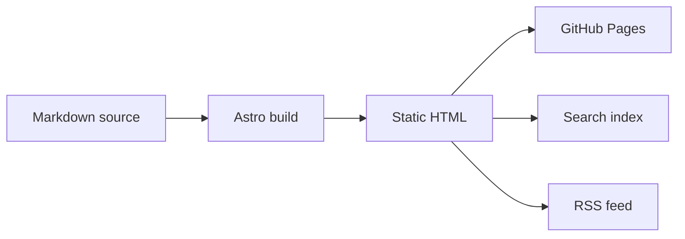
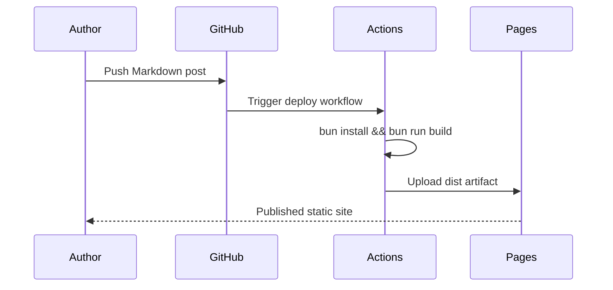

This unlisted page is a private smoke-test for the richer publishing features supported by the Astro blog. It should be reachable by direct URL, but absent from the homepage, RSS feed, topic pages, author pages, API listings, and search index.

## Markdown basics

A paragraph can include **bold text**, *emphasis*, `inline code`, and links such as [the Netherlands eScience Center](https://www.esciencecenter.nl/).

> A blockquote should feel calm and editorial, not like a loud callout.

Lists should remain readable:

- research software;
- reproducible workflows;
- public knowledge archives.

## Code blocks

```python
def estimate_reading_time(words: int, words_per_minute: int = 225) -> int:
    return max(1, round(words / words_per_minute))

print(estimate_reading_time(900))
```

## Inline and block LaTeX

Inline math should render inside a sentence: the third power of two is $2^3 = 8$.

Block math should render centered and readable:

$$
e^{i \theta} = \cos \theta + i \sin \theta
$$

A slightly more research-flavoured example:

$$
\operatorname{softmax}(x_i) = \frac{e^{x_i}}{\sum_j e^{x_j}}
$$

## Mermaid diagram



## Mermaid sequence diagram



## Native HTML details

<details>
  <summary>Expandable technical note</summary>

  This uses raw HTML inside Markdown. It is useful for lightweight editorial affordances without building a custom component.
</details>

## YouTube embed

The blog can embed external media when needed. This example intentionally uses a privacy-enhanced YouTube URL.

<iframe
  width="560"
  height="315"
  src="https://www.youtube-nocookie.com/embed/dQw4w9WgXcQ"
  title="Example embedded video"
  frameborder="0"
  allow="accelerometer; autoplay; clipboard-write; encrypted-media; gyroscope; picture-in-picture; web-share"
  allowfullscreen>
</iframe>

## External page embed

A generic iframe can also embed simple external content where allowed by the remote site.

<iframe
  src="https://www.esciencecenter.nl/"
  title="Netherlands eScience Center website"
  loading="lazy"
  style="width: 100%; min-height: 360px; border: 1px solid #e5e5e5; border-radius: 12px;">
</iframe>

## Table

| Feature | Status | Notes |
| --- | --- | --- |
| Markdown | ✅ | Default Astro content pipeline |
| LaTeX | ✅ | `remark-math` + `rehype-katex` |
| Mermaid | ✅ | Client-side rendering from fenced code blocks |
| Embeds | ✅ | Raw HTML iframe support |
| Listed publicly | ❌ | `unlisted: true` excludes this page from indexes |

## Image path sanity check

This uses a repository-managed asset through the same `/assets/...` convention as migrated Medium posts.


## End of test page

If every section above renders cleanly, the content pipeline is ready for more technical editorial posts.
